# CJM-01M: Новый пользователь (Mobile)

> **Участники:** Пользователь, Система
> **Платформа:** Mobile-first (iOS/Android WebView)
> **Фазы:** 4 (Регистрация → Профиль → План → Трекинг)

```plantuml
@startuml CJM-01M — Новый пользователь (Mobile)
!theme plain
skinparam backgroundColor white
skinparam defaultFontName Arial
title CJM Mobile: Новый пользователь

|#E8F5E9| Пользователь |
|#E3F2FD| Система |

|#F5F5F5| **Фаза 1. Быстрый вход** |
|Пользователь| :Открывает приложение,\nвидит лендинг;\n:Тап «Войти через Telegram»\n(или email);
|Система| :OAuth / SMS за 5 сек;\n:JWT → localStorage;

|#F5F5F5| **Фаза 2. Профиль** |
|Система| :Шоу-керинг:\n«Давай познакомимся!»;\n:Предлагает 3 вопроса;
|Пользователь| :Отвечает:\n«Хочу похудеть на 5 кг»;\n«Мне 30, вес 80 кг»;\n«Не люблю бегать»;
|Система| :Автосохранение\nпосле каждого ответа;

|#F5F5F5| **Фаза 3. Рекомендация** |
|Система| :За 3 сек генерирует\nплан из 3 пунктов;\n:Показывает один экран\nс кнопкой «Начать»;
|Пользователь| :Видит 3 действия\nна сегодня;\n:Тап → попадает в чат;
|Пользователь| :Может сказать\n«Упрости» / «Сложнее»;

|#F5F5F5| **Фаза 4. Выполнение** |
|Пользователь| :Открывает пуш:\n«Завтрак — отметь КБЖУ»;\n:Ставит ✅, тап «готово»;
|Система| :Показывает streak\nи уровень;

@enduml
```

---

## Упрощённые фазы (mobile)

### Фаза 1. Быстрый вход
| Шаг | Пользователь | Система |
|-----|-------------|---------|
| 1 | Тап «Войти через Telegram» | OAuth, 5 сек |
| 2 | Разрешает доступ к номеру | Создаёт профиль |
| 3 | Видит пустой дашборд | Показывает шоу-керинг |

### Фаза 2. Профиль (3 вопроса)
| Шаг | Пользователь | Система |
|-----|-------------|---------|
| 1 | Отвечает на вопрос «Цель» | Показывает чипсы: похудеть/мышцы/здоровье |
| 2 | Вводит возраст, вес, рост | Числовые инпуты с клавиатурой |
| 3 | Выбирает уровень активности | 3 карточки (низкий/средний/высокий) |

### Фаза 3. План на сегодня
| Шаг | Пользователь | Система |
|-----|-------------|---------|
| 1 | Видит 3 действия | «Не больше 3 — чтобы не перегружать» |
| 2 | Может тапнуть → детали | Разворачивающаяся карточка |
| 3 | Говорит «Упрости» | Chat-интерфейс, LLM пересчёт |

### Фаза 4. Трекинг
| Шаг | Пользователь | Система |
|-----|-------------|---------|
| 1 | Получает пуш-уведомление | «🍽 Завтрак — запиши КБЖУ» |
| 2 | Открывает → ставит ✅ | Анимация +15 звёзд |
| 3 | Закрывает до следующего пуша | Streak: 🔥 5 дней |

---

## Отличия от десктоп-версии

| Аспект | Desktop | Mobile |
|--------|---------|--------|
| Вход | Email + пароль + JWT | Telegram OAuth / SMS 5 сек |
| Профиль | 50+ параметров DT, голосовой ввод | 3 вопроса, чипсы, числовые инпуты |
| План | DAW-таймлайн, drag-and-drop, протоколы | 3 действия на сегодня, чат |
| Трекинг | Дневник питания с фото, селектор продуктов | Пуш + ✅, минимальный ввод |
| Глубина | 5 фаз, 20+ шагов | 4 фазы, 10 шагов |
| Время | 10–15 мин до первого плана | 2–3 мин до первого плана |

---

## Ключевые решения для mobile

1. **Telegram OAuth как primary** — пользователь заходит за 1 тап, без паролей
2. **3 вопроса вместо 50 параметров** — cold start; остальное донабирается через пуш-опросы
3. **3 действия на сегодня** — не более, чтобы не пугать объёмом
4. **План всегда можно изменить через чат** — «Упрости», «Добавь», «Сложнее»
5. **Streak + пуш-напоминания** — основной механизм удержания
