# CJM-02: Активный пользователь (Pro)

> **Файл диаграммы:** `docs/development/08.02_cjm_active_user.puml`
> **Участники:** Пользователь, Система
> **Фазы:** 4 (Ежедневный трекинг → Просмотр прогресса → Корректировка целей → Чат с AI)

```plantuml
@startuml CJM-02 — Активный пользователь (Pro)
!theme plain
skinparam backgroundColor white
skinparam defaultFontName Arial
title Customer Journey Map: Активный пользователь (Pro)

|#E8F5E9| Пользователь |
|#E3F2FD| Система |

|#F5F5F5| **Фаза 1. Ежедневный трекинг** |
|Пользователь| :Открывает дневник питания\n(иконка в хедере);
|Пользователь| :Вносит завтрак:\nпоиск продукта,\nкорректирует КБЖУ;
|Система| :Ищет по базе продуктов\n(1000+ записей);
|Пользователь| :Добавляет фото приёма\nчерез селектор;
|Система| :Сохраняет запись\nчерез POST /api/diary;

|#F5F5F5| **Фаза 2. Просмотр прогресса** |
|Пользователь| :Открывает раздел\n«Ваш Путь» (/path);
|Система| :Показывает прогресс-бар,\nstreak дней, уровень;
|Пользователь| :Просматривает\nсостояние DT (энергия,\nстресс, фокус);
|Пользователь| :Проверяет\nвыполненные задачи;

|#F5F5F5| **Фаза 3. Корректировка целей** |
|Пользователь| :Открывает Goal Chat\nиз хедера дашборда;
|Система| :Показывает чат-визард;\nпредлагает 12 целей;
|Пользователь| :Выбирает до 3 целей\n(вес, сон, АД);
|Система| :Сохраняет цели,\nобновляет прогресс-бары;

|#F5F5F5| **Фаза 4. Чат с AI** |
|Пользователь| :Пишет вопрос\nв AI-ассистент;
|Система| :GigaChat отвечает\nс учётом профиля;
|Пользователь| :Получает персонализи-\nрованную рекомендацию;

@enduml
```

---

## Фаза 1. Ежедневный трекинг питания

**Цель:** Зафиксировать дневной рацион и самочувствие.

| Шаг | Actor | Действие | Система | Интерфейс |
|-----|-------|----------|---------|-----------|
| 1.1 | Пользователь | Открывает дневник питания (кнопка в хедере дашборда) | Показывает модалку Diary для текущего дня | Diary Popup |
| 1.2 | Пользователь | Нажимает «+» в секции «Завтрак», ищет «овсянка» в селекторе | Открывает Food Selector, фильтрует по запросу | Food Selector Modal |
| 1.3 | Система | — | Подставляет КБЖУ из базы продуктов (1000+ записей) | Карточка продукта с калориями |
| 1.4 | Пользователь | Корректирует порцию, добавляет фото приёма | Сохраняет выбранный продукт в форму приёма | Input порции + превью фото |
| 1.5 | Пользователь | Повторяет для обеда, ужина, перекуса | Суммирует КБЖУ по всем приёмам | Обновление итогов |
| 1.6 | Пользователь | Регулирует слайдер воды (1500 мл), оценивает самочувствие | Сохраняет метрики | Слайдеры + цветовые индикаторы |
| 1.7 | Пользователь | Нажимает «Сохранить» | POST /api/diary | Подтверждение сохранения |

**Ключевые точки:**
- Голосовой ввод описания приёма пищи
- Загрузка аудиофайлов (.mp3/.wav) для консультаций
- Автоматический расчёт КБЖУ на сумму всех приёмов

---

## Фаза 2. Просмотр прогресса

**Цель:** Оценить динамику и текущие достижения.

| Шаг | Actor | Действие | Система | Интерфейс |
|-----|-------|----------|---------|-----------|
| 2.1 | Пользователь | Открывает раздел «Ваш Путь» (роут /path) | Загружает ProgressPath | Прогресс-путь |
| 2.2 | Система | — | Показывает: 840 звёзд, 68% плана, 5 дней подряд, уровень «Functional Application» | Хедер с метриками |
| 2.3 | Пользователь | Просматривает состояние цифрового двойника | Показывает 5 индикаторов: энергия 75%, фокус 60%, стресс 40%, сон 70%, настроение 65% | Progress-бары |
| 2.4 | Пользователь | Смотрит рекомендованные интервенции | 3 карточки: ментальное, физическое, образ жизни | Карточки с ссылкой на /chat |

**Ключевые точки:**
- DeviceDropZone для дропа данных с носимых устройств
- Множественный выбор профилей для сравнения
- Каждая интервенция ведёт в чат с предзаполненным контекстом

---

## Фаза 3. Корректировка целей

**Цель:** Обновить целевые метрики через Goal Chat.

| Шаг | Actor | Действие | Система | Интерфейс |
|-----|-------|----------|---------|-----------|
| 3.1 | Пользователь | Нажимает на целевые значения в хедере дашборда | Открывает Goal Chat Popup | Чат-попап |
| 3.2 | Система | — | Приветствует, показывает список из 12 целей | Сообщение бота + чипсы целей |
| 3.3 | Пользователь | Выбирает «Снизить вес до 70 кг», «Улучшить сон до 8 ч», «Нормализовать АД до 120/80» | Сохраняет выбор | Бейджи выбранных целей |
| 3.4 | Пользователь | Подтверждает выбор (кнопка «Далее») | Обновляет goals в state, перерисовывает прогресс-бары | Цели отображаются в хедере |

**Ключевые точки:**
- 12 целей: вес, ИМТ, сон, стресс, шаги, глюкоза, HbA1c, ЛПНП, ЛПВП, вит.D, вода, талия
- Цели отображаются как прогресс-бары с целевым значением
- Goal Chat — чатовый интерфейс с ботом, а не просто форма

---

## Фаза 4. Чат с AI-ассистентом

**Цель:** Получить ответ на конкретный вопрос с учётом прогресса.

| Шаг | Actor | Действие | Система | Интерфейс |
|-----|-------|----------|---------|-----------|
| 4.1 | Пользователь | Открывает /chat, пишет «Не получается соблюдать интервальное голодание, что делать?» | POST /api/chat | Чат |
| 4.2 | Система | — | GigaChat анализирует: профиль + история диалога + цели | «Думаю...» |
| 4.3 | Система | — | Предлагает альтернативный протокол, корректирует план | AI-сообщение с рекомендацией |
| 4.4 | Пользователь | Меняет план в соответствии с рекомендацией | Обновляет таймлайн | План скорректирован |

---

## Сводка метрик

| Метрика | Целевое значение |
|---------|-----------------|
| Время внесения дневника | < 5 мин |
| Частота использования | Ежедневно |
| Среднее количество запросов в чат | 3–5 в день |
| Процент достижения целей | > 60% через 30 дней |
