# CJM-05: Пользователь на этапе пилотирования

> **Файл диаграммы:** `docs/development/08.05_cjm_pilot_user.puml`
> **Участники:** Пользователь, Система
> **Фазы:** 4 (Онбординг / подбор протокола → Настройка таймлайна → Ежедневное выполнение → Контрольная точка)

```plantuml
@startuml CJM-05 — Пользователь на этапе пилотирования
!theme plain
skinparam backgroundColor white
skinparam defaultFontName Arial
title Customer Journey Map: Пользователь на этапе пилотирования

|#E8F5E9| Пользователь |
|#E3F2FD| Система |

|#F5F5F5| **Фаза 1. Онбординг / Подбор протокола** |
|Пользователь| :Переходит на /flow;\n(«Подбор протокола»);
|Система| :Анализирует параметры DT;\nвычисляет pSuccess;
|Система| :Показывает Top-3 протокола\nс вероятностью успеха;
|Пользователь| :Выбирает протокол\n(например, «Средиземноморская диета»);
|Система| :Подтверждает выбор,\nпоказывает evidence level;
|Пользователь| :Переходит к дашборду;

|#F5F5F5| **Фаза 2. Настройка таймлайна** |
|Пользователь| :Видит протокол\nна таймлайне;
|Пользователь| :Добавляет дополнительные\nинтервенции из каталога;
|Система| :Размещает их на треках\nс днями активации;
|Пользователь| :Запускает симуляцию;

|#F5F5F5| **Фаза 3. Ежедневное выполнение** |
|Пользователь| :Отмечает выполненные\nзадачи;
|Система| :Начисляет звёзды,\nобновляет прогресс;
|Пользователь| :Ведёт дневник\nпитания;
|Пользователь| :Задаёт вопросы\nAI-ассистенту;

|#F5F5F5| **Фаза 4. Контрольная точка** |
|Система| :Формирует отчёт\nза период;
|Пользователь| :Скачивает историю\nкак .txt;
|Пользователь| :Показывает врачу\nна контрольном приёме;

@enduml
```

---

## Фаза 1. Онбординг / Подбор протокола

**Цель:** Подобрать оптимальный протокол через Decision Flow симулятор.

| Шаг | Actor | Действие | Система | Интерфейс |
|-----|-------|----------|---------|-----------|
| 1.1 | Пользователь | Открывает /flow («Подбор протокола») | Загружает DecisionFlowSimulation | Decision Flow |
| 1.2 | Система | — | Загружает параметры DT (17 полей) из DEFAULT_DT или из profileOverrides | Хедер с заполненностью X/Y |
| 1.3 | Система | — | Автоматически переходит в фазу WELCOME: «Анализ ваших данных...» (1.2 сек) | Сообщение-приветствие |
| 1.4 | Система | — | Вычисляет pSuccess для 9 протоколов через matchQuality + веса | Top-3 карточки |
| 1.5 | Пользователь | Смотрит Top-3: «Средиземноморская диета» (78%), «DASH» (72%), «16:8» (65%) | Отображает: медаль, название, категорию, % вероятности, персонализацию | 3 карточки с рейтингом |
| 1.6 | Пользователь | Нажимает «Запросить данные (HbA1c)» — хочет уточнить подбор | Система находит bestNextRequest по критерию deltaU/effort | Кнопка запроса данных |
| 1.7 | Система | — | Показывает форму: «HbA1c — гликированный гемоглобин, ед. %, impact 0.31» | Форма с input + confirm/skip |
| 1.8 | Пользователь | Вводит «5.4» и нажимает «Подтвердить» | Обновляет dt, пересчитывает pSuccess, показывает обновлённый Top-3 | Input → обновлённые карточки |
| 1.9 | Пользователь | Выбирает «Средиземноморская диета» (1-е место) | Переход в фазу SELECTED: зелёный прогресс-бар, evidence level | Подтверждение выбора |
| 1.10 | Система | — | Через 600 мс переходит в DONE, показывает «К дашборду» | Кнопка перехода |

**Ключевые точки:**
- 9 протоколов: Mediterranean, DASH, 16:8 IF, GLP-1 agonists, CBT, VLCD keto, Mindful eating, Exercise, Lab-based grocery habit
- Алгоритм pSuccess = 35% matchQuality + 25% effect + 20% adherence + 20% evidence
- Data request выбирается по max(deltaU / effort) среди незаполненных параметров
- Системный лог с timestamp фиксирует каждое действие

---

## Фаза 2. Настройка таймлайна

**Цель:** Разместить выбранный протокол на таймлайне и добавить дополнительные интервенции.

| Шаг | Actor | Действие | Система | Интерфейс |
|-----|-------|----------|---------|-----------|
| 2.1 | Пользователь | После нажатия «К дашборду» попадает на дашборд с выбранным профилем | Tab «Интервенции» активен | DigitalTwin |
| 2.2 | Система | — | Протокол «Средиземноморская диета» уже размещён на треке | DAW-трек |
| 2.3 | Пользователь | Открывает правую панель каталога, ищет дополнительные интервенции | Фильтрует по категории | Interventions Panel |
| 2.4 | Пользователь | Перетаскивает «Прогулка 30 мин» на таймлайн | Новый трек появляется ниже | Drag-and-drop |
| 2.5 | Пользователь | Настраивает дни активации и регулярность | Редактирует параметры трека | Клик по треку → настройки |
| 2.6 | Пользователь | Запускает симуляцию (Play) | Playhead движется, дни подсвечиваются | Анимация симуляции |
| 2.7 | Пользователь | Останавливает симуляцию, сохраняет план | План готов | Prescription popup |

---

## Фаза 3. Ежедневное выполнение

**Цель:** Выполнять назначенные интервенции, вести дневник, отслеживать прогресс.

| Шаг | Actor | Действие | Система | Интерфейс |
|-----|-------|----------|---------|-----------|
| 3.1 | Пользователь | Открывает дашборд, таймлайн показывает сегодняшние задачи | Подсвечивает день playhead'ом | DAW-таймлайн |
| 3.2 | Пользователь | Отмечает «Прогулка 30 мин» как выполненную | +15 звёзд, трек подсвечивается зелёным | Чекбокс с анимацией |
| 3.3 | Пользователь | Ведёт дневник питания: завтрак, обед, ужин | POST /api/diary | Diary popup |
| 3.4 | Пользователь | Задаёт вопрос AI: «Какие продукты适合 для средиземноморской диеты?» | POST /api/chat с контекстом профиля + протокола | Чат |
| 3.5 | Система | — | GigaChat отвечает с учётом выбранного протокола | AI-сообщение |

---

## Фаза 4. Контрольная точка

**Цель:** Подвести итоги периода, сформировать отчёт.

| Шаг | Actor | Действие | Система | Интерфейс |
|-----|-------|----------|---------|-----------|
| 4.1 | Пользователь | Открывает History Popup | Формирует полный отчёт за период | History popup |
| 4.2 | Система | — | Показывает: summary stats, per-intervention status, детальный лог | Полный отчёт |
| 4.3 | Пользователь | Нажимает «Download as .txt» | Генерирует и скачивает .txt | Скачивание |
| 4.4 | Пользователь | Приносит отчёт на контрольный приём к врачу | — | Офлайн |
| 4.5 | Врач | Анализирует отчёт, корректирует план | PUT /api/profiles/:id | Новый план |

**Ключевые точки:**
- Отчёт содержит: количество выполненных дней, adherence %, изменение метрик
- Врач видит ту же историю в своём интерфейсе
- После корректировки цикл повторяется (Фаза 2 → Фаза 3 → Фаза 4)

---

## Сводка метрик

| Метрика | Целевое значение |
|---------|-----------------|
| Время подбора протокола | < 5 мин |
| Adherence за период пилота | > 70% |
| Снижение веса за 3 месяца | > 5% |
| Количество обращений в чат | 3–7 в неделю |
