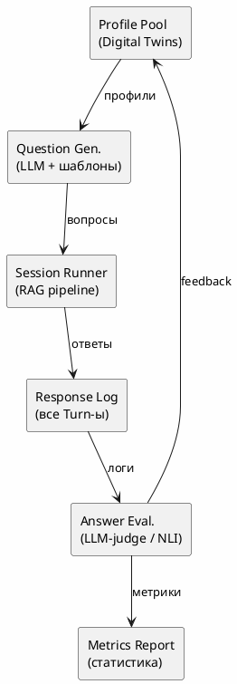

# Pre-development Interview: RAG Architecture for Healora

> ✅ **Отвечено:** Q1–Q4
> ⏳ **Ждут ответа:** Q5–Q8 (обязательны для старта), Q9–Q15 (можно по ходу)

---

## ✅ Q1. Цели RAG — что первично?

**Ответ:** 🅰 + 🅱 (чат Q&A и генерация планов терапии). Соотношение 80/20.

**Детализация:**
- RAG не нужен (чистая генерация): приветствия, напоминания, мотивационные сообщения, простые факты (калорийность яблока), рерайт пользовательского текста. Остальное — через RAG.
- Мультиязычность: не нужна (только русский).

---

## ✅ Q2. Механизм персонализации — какой глубины?

**Ответ:** Уровни 2 + 3 + 4 (все, кроме изолированного Level 1).

- **Level 1 (Prompt Injection)** — будет как база, но не единственный механизм
- **Level 2 (Filtered Retrieval)** — да, фильтруем по лабам/возрасту/полу/противопоказаниям
- **Level 3 (Weighted Scoring)** — да, каждая рекомендация с весом
- **Level 4 (Graph-Based)** — да, граф дефицитов

Дополнительно:
- Динамическая персонализация по дневнику — **да**
- Учёт compliance — **да**
- explainability (почему эта рекомендация) — **да**

> **Предложение по Level 1:** альтернативы prompt injection — динамический список ингредиентов профиля в system prompt (только ключевые поля), injection через RAG-контекст (профиль как отдельный чанк), или fine-tuning на синтетических диалогах. Prompt injection — самый простой, оставляем как базовый слой.

---

## ✅ Q3. Нужен ли граф связей (Knowledge Graph)?

**Ответ:** Вариант 4 — **Hybrid (Vector + Graph)**. Но с поэтапным подходом.

**Оценка "плоский поиск → граф":**
- **За:** быстрый запуск (vector search делается за день), проверка гипотез на реальных пользователях, не перепроектируем, пока не поняли паттерны запросов.
- **Против:** придётся перестраивать retrieval-пайплайн при добавлении графа, часть цепочек "почему" будет недоступна, может накопиться технический долг.

**Рекомендация:** старт с Vector Search + Metadata Filters (v1), граф — во v2 после анализа реальных запросов.

**Динамика графа:** связи статичны (condition→protocol, food→nutrient) и меняются только при добавлении новых протоколов/каталогов. Динамическая часть — только профиль пользователя, который и так живёт отдельно.

---

## ✅ Q4. Частота обновления эмбеддингов

| Данные | Режим | Обоснование |
|---|---|---|
| Протоколы / интервенции | **По изменению файла** | Меняются редко, триггер — git push / deploy |
| Профили пользователей | **При каждом обновлении лаб** | Критично для персонализации |
| Дневник питания | **Real-time** | immediate feedback в чате |
| Каталоги (еда, практики) | **Раз в релиз** | Статичны, меняются только при обновлении данных |

- Инкрементальная индексация: **да** (только новые/изменённые чанки)
- Задержка в 1 час: допустима для каталогов, **недопустима** для профилей и дневника (пользователь ждёт ответ здесь и сейчас)

---

## ✅ Q5. LLM backbone и Embeddings

**Ответ:**
| Параметр | Значение |
|---|---|
| LLM | **GigaChat-Max** (уже подключён) |
| Embedding | **GigaChat embedding** (через тот же API) |
| Язык | **Русский** |
| Допустимый latency | **<5s** |
| Streaming | **Да** |

---

## ✅ Q6. Chunking стратегия

**Ответ:**
| Параметр | Значение |
|---|---|
| Протоколы | **Hierarchical** (summary + детальные шаги) |
| Overlap | **128 токенов** |
| Коллекции | **Одна** (с фильтрацией по domain field) |
| Exact-match индекс | **Да** (для быстрого поиска по ID) |

---

## ✅ Q7. Retrieval стратегия

**Ответ:**
| Параметр | Значение |
|---|---|
| Стратегия | **Hybrid** (dense + sparse) |
| top-K | **5** |
| Re-ranker | **Нет** (на первых порах) |
| HyDE | **Нет** |
| Нет релевантных чанков | **Генерация из знаний LLM + disclaimer** |

---

## ✅ Q8. Reranking и фильтрация

**Ответ:**
| Параметр | Значение |
|---|---|
| Cross-encoder | **Нет** (на первых порах) |
| Фильтры | **All** (возраст, лабы, противопоказания) |
| Порог релевантности | **0.7** |
| Дедупликация | **Да** |

---

## 📋 Q9–Q15. Вопросы второй очереди (можно отвечать по ходу разработки)

Эти блоки не блокируют старт прототипа, но нужны для production:

| # | Тема | Суть |
|---|------|------|
| **Q9** | Недостающие сущности | Evidence Base, Contraindication Matrix, Scoring Model, Session Context, Interaction Model, Timeline, User Feedback |
| **Q10** | Оценка качества RAG | Golden dataset, human-in-loop, метрики (Hit Rate, Faithfulness, Hallucination Rate) |
| **Q11** | Observability | Логи, dashboard, детекция дрифта, A/B testing, feedback loop |
| **Q12** | Мультимодальность | Фото еды, voice notes, wearables |
| **Q13** | Инфраструктура | Vector DB (Qdrant/Chroma/etc), self-host vs cloud, async indexing, budget |
| **Q14** | Безопасность / Privacy | Изоляция эмбеддингов, 152-ФЗ, GDPR, tenant isolation |
| **Q15** | Приоритизация roadmap | Таблица Must/Should/Nice |

---

## Q16. Метрики оценки для разных режимов работы

Система работает в 4 режимах, для каждого нужны свои метрики. Предлагаю фреймворк оценки.

---

### 16.1 Долгосрочные планы (протоколы на 7–90 дней)

| Метрика | Формула / Описание | Способ сбора |
|---|---|---|
| **Adherence Rate (AR)** | % выполненных шагов плана от запланированных | Дневник / трекер |
| **Completion Rate (CR)** | % планов, доведённых до конца | Логи |
| **Outcome Effect Size (OES)** | `(pre_value - post_value) / pre_value` по ключевым биомаркерам | Лабы до/после |
| **Plan Stability Index (PSI)** | Количество отклонений от плана / длительность плана | Логи изменений |
| **Attrition Rate** | % брошенных планов в первые 7 дней | Когортный анализ |
| **Time-to-First-Deviation** | Среднее время до первого пропущенного шага | Survival analysis |

**Персонализация:**
| Метрика | Описание |
|---|---|
| **Personalization Delta (PD)** | Косинусное расстояние между эмбеддингом плана пользователя и средним "типовым" планом для того же диагноза: `PD = 1 - cos(E_user, E_template)`. Чем больше — тем уникальнее план. |
| **Adaptation Rate (AR)** | Как часто план меняется под новые данные (лабы, дневник) |
| **Context Fit Score (CFS)** | Оценка LLM: "насколько план учитывает образ жизни, график, ограничения пользователя" (Likert 1–5) |
| **Baseline Drift** | Насколько план отличается от baseline-протокола (кол-во изменённых шагов / общее кол-во) |

**Доказательность:**
| Метрика | Описание |
|---|---|
| **Mean Evidence Level (MEL)** | Средневзвешенный уровень доказательности всех рекомендаций в плане: `MEL = Σ(evidence_level_i * weight_i) / Σ(weight_i)`, где A=4, B=3, C=2, D=1 |
| **Evidence Coverage (EC)** | % рекомендаций, имеющих ссылку на источник |
| **Citation Accuracy (CA)** | % цитат, которые реально подтверждают утверждение (проверка экспертом) |
| **Contraindication Violations** | Количество рекомендаций, нарушающих известные противопоказания |

---

### 16.2 Краткосрочные рекомендации (ежедневные задачи, приёмы пищи, физическая активность, сон, самообразование)

| Метрика | Описание |
|---|---|
| **Actionability Score (AS)** | Оценка LLM + user: рекомендация выполнима в текущем контексте? (1–5) |
| **Relevance Score (RS)** | Cosine similarity между эмбеддингом рекомендации и эмбеддингом current user state |
| **Timeliness (TL)** | Время от запроса до получения рекомендации в секундах |
| **Task Completion Rate (TCR)** | % выданных задач, которые пользователь отметил выполненными |
| **Click-Through Rate (CTR)** | % рекомендаций, по которым пользователь перешёл/начал выполнение |
| **Snooze Rate** | % отложенных рекомендаций (пользователь отложил на потом) |
| **Implicit Feedback Score (IFS)** | Анализ времени просмотра, дочитывания, повторного запроса |

**Pairwise метрики (для сравнения стратегий):**

| Метрика | Описание |
|---|---|
| **Δ Adherence (A/B)** | `Adherence_A - Adherence_B` между двумя retrieval-стратегиями |
| **Win Rate** | % пользователей, у которых стратегия A дала лучший AR, чем B |
| **Preference Test** | Double-blind: пользователь выбирает между 2 рекомендациями (не зная источник) |

---

### 16.3 Переписка (чаты с AI-ассистентом)

**Качество диалога:**

| Метрика | Описание | Сбор |
|---|---|---|
| **Response Relevance (RR)** | Оценка LLM-судьёй: ответ релевантен вопросу? (1–5) | Авто |
| **Factual Consistency (FC)** | % утверждений в ответе, подтверждённых RAG-контекстом | Авто (NLI) |
| **Hallucination Rate (HR)** | % утверждений, не найденных в источниках | Авто (NLI) |
| **Coherence Score (CS)** | Логическая связность ответа в контексте истории диалога | LLM-judge |
| **Helpfulness (HS)** | Оценка пользователем: "Вам помог ответ?" (like/dislike) | User click |
| **Follow-up Rate (FUR)** | % диалогов, где пользователь задал уточняющий вопрос после ответа | Анализ логов |
| **Conversation Length (CL)** | Среднее кол-во сообщений в сессии до решения задачи | Анализ логов |
| **First Response Resolution (FRR)** | % сессий, где первый ответ решил вопрос пользователя | Экспертная |
| **Toxicity / Safety (TS)** | % ответов, содержащих небезопасный контент | Классификатор |
| **Refusal Rate (RR)** | % вопросов, на которых ассистент корректно отказался отвечать (вне зоны компетенции) | Анализ логов |

**Персонализация в диалоге:**

| Метрика | Описание |
|---|---|
| **Context Recall** | % ответов, где используется контекст из предыдущих сообщений (не только последнего) |
| **Tone Adaptation** | Совпадение тона ассистента с предпочтением пользователя (формальный/дружеский) |
| **Personal Entity Recall** | Упоминание имени, целей, истории пользователя в ответе |
| **Misunderstanding Rate** | % случаев, когда ассистент неправильно интерпретировал запрос (переспрос пользователя) |

---

### 16.4 Ad-hoc советы (быстрые ответы без глубокого поиска)

| Метрика | Описание |
|---|---|
| **Response Speed (RS)** | Время от запроса до первого токена (TTFT) |
| **Safety Pass Rate (SPR)** | % ad-hoc советов, не содержащих опасных рекомендаций |
| **Generic vs Specific Ratio (GSR)** | Доля советов, использующих данные пользователя vs. общих фраз |
| **Band-aid Effect (BAE)** | % советов, дающих временное решение вместо устранения причины |
| **Escalation Rate (ER)** | % ad-hoc ответов, которые перешли в полноценный анализ/план |
| **Confidence Calibration (CC)** | Корреляция между уверенностью модели и фактической полезностью (по feedback) |

---

### 16.5 Композитные метрики (сквозные)

| Метрика | Формула | Смысл |
|---|---|---|
| **Personalized Health Score (PHS)** | `w1*AR + w2*OES + w3*MEL + w4*CFS` | Единый индекс качества ведения пользователя |
| **Recommendation Quality Index (RQI)** | `w1*RR + w2*FC + w3*HS + w4*AS` | Качество отдельной рекомендации |
| **System Trust Score (STS)** | `1 - (HR + MisunderstandingRate + ToxicityRate)/3` | Доверие пользователя к системе |
| **User Progress Velocity (UPV)** | `Δ PHS / Δ t` (изменение PHS за единицу времени) | Скорость прогресса пользователя |
| **Personalization Penetration (PP)** | % сессий, где использованы данные >2 источников (лабы + дневник + wearables) | Глубина использования данных |
| **Evidence-Personalization Balance (EPB)** | `corr(MEL, PD)` — корреляция доказательности и персонализации. Идеал: высокий MEL + высокий PD | Нет ли перекоса в пользу одного? |

---

### 16.6 Сценарии проверки метрик

#### Сценарий A: A/B тест стратегий retrieval
```
Цель: сравнить Naive RAG vs. Hybrid RAG для персональных рекомендаций
(физическая активность, диета, сон, самообразование)

Метод:
1. Рандомизация 1000 пользователей в 2 группы (A: naive, B: hybrid)
2. Каждый пользователь получает 5 персонализированных рекомендаций
   (рандомизировано по доменам: активность, диета, сон, практики)
3. Метрики:
   - CTR на рекомендации
   - Task Completion Rate (начал выполнять / отметил выполнение)
   - Adherence через 7 дней
   - Пользовательский фидбек (like/dislike)
4. Статистика: двухвыборочный t-test (или Mann-Whitney, если ненормальное распределение)
5. Множественное тестирование: поправка Бонферрони (α / k метрик)
6. Длительность: 14 дней
7. Минимальный эффект (MDE): +5% по CTR, power=0.8, α=0.05
```

#### Сценарий B: Оценка персонализации (Interleaved Preferences)
```
Цель: проверить, что персонализированная рекомендация лучше типовой

Метод:
1. Пользователю показываются 2 варианта совета (один — generic, другой — персонализированный)
2. Пользователь выбирает лучший (не зная, какой какой)
3. Метрика: Win Rate персонализированного совета
4. Статистика: биномиальный тест (H0: p=0.5, H1: p>0.5)
5. Минимальная выборка: n=30 для power=0.8 при p=0.7
```

#### Сценарий C: Оценка галлюцинаций в чате
```
Цель: измерить Factual Consistency ответов ассистента

Метод:
1. Собрать 200 диалогов (реальных или синтетических)
2. Для каждого ответа извлечь утверждения (claim extraction)
3. Каждое утверждение проверить:
   - Автоматически: NLI-модель (True / False / Not enough info)
   - Экспертно: выборка 20% утверждений врачом-диетологом
4. Метрики:
   - Hallucination Rate (HR) = ложные / всего
   - Precision автооценки vs. эксперт (confusion matrix)
   - Cohen's Kappa между авто и экспертом
5. Статистика: доверительный интервал для HR (Wilson CI)
6. Приемлемый порог: HR < 5%
```

#### Сценарий D: Оценка долгосрочного плана
```
Цель: сравнить план, сгенерированный RAG, с планом, составленным экспертом

Метод:
1. 10 кейсов (digital twin профилей)
2. Для каждого: экспертный план + RAG-план (слепое сравнение)
3. 3 эксперта оценивают по шкале:
   - Медицинская корректность (1–5)
   - Персонализация (1–5)
   - Полнота (1–5)
   - Практическая выполнимость (1–5)
4. Метрики:
   - Mean Score по каждому критерию
   - Inter-Rater Reliability (ICC — Intraclass Correlation Coefficient)
   - % случаев, где RAG-план не уступает экспертному (non-inferiority test)
5. Статистика:
   - Non-inferiority margin: Δ = -0.5 балла (5-балльная шкала)
   - Односторонний t-test: H0: μ_RAG ≤ μ_exp - Δ, H1: μ_RAG > μ_exp - Δ
```

#### Сценарий E: Оценка безопасности ad-hoc советов
```
Цель: убедиться, что быстрые советы не опасны

Метод:
1. Собрать 500 типовых вопросов из чата (реальных)
2. Классифицировать по уровню риска:
   - Green: общие вопросы (что съесть на завтрак)
   - Yellow: требует осторожности (можно ли принимать железо и кальций вместе)
   - Red: требует отказа (симптомы острого панкреатита)
3. Для Red-вопросов: ожидаемый ответ — отказ с рекомендацией к врачу
4. Метрики:
   - Safety Pass Rate (SPR) для Yellow (не должен дать вредный совет)
   - Refusal Rate (RR) для Red (должен отказаться)
   - False Positive Refusal (FPR): отказался от ответа, хотя мог дать безопасный совет
5. Статистика: confusion matrix, F1-score по каждому уровню риска
```

#### Сценарий F: Оценка Evidence Alignment
```
Цель: проверить, что рекомендации соответствуют заявленному уровню доказательности

Метод:
1. Выбрать 50 рекомендаций из разных уровней доказательности (A/B/C/D)
2. Для каждой: эксперт проверяет корректность уровня и наличие ссылки
3. Метрики:
   - Evidence Label Accuracy (ELA): % правильных уровней
   - Citation Verifiability (CV): % ссылок, ведущих на реальные источники
   - Evidence Gap (EG): % рекомендаций высокого уровня (A/B) без ссылок
4. Статистика: точность + 95% CI (Clopper-Pearson)
```

#### Сценарий G: Long-term impact (когортное исследование)
```
Цель: оценить реальное влияние RAG-рекомендаций на здоровье пользователей

Метод:
1. Стратифицированная рандомизация по возрасту, полу, диагнозам
2. Группа A: RAG-ассистент (полный пайплайн)
3. Группа B: static контент (базовые статьи без персонализации)
4. Длительность: 90 дней
5. Метрики:
   - Primary: Δ ключевого биомаркера (глюкоза, HbA1c, BMI, Ferritin)
   - Secondary: Adherence, Satisfaction (SUS score), Quality of Life (SF-36)
6. Статистика:
   - ANCOVA с поправкой на baseline (pre-treatment value как ковариата)
   - Intention-to-Treat (ITT) анализ
   - Mixed-effects model для повторных измерений
   - Number Needed to Treat (NNT) для клинически значимого улучшения
7. Power analysis: n=200 на группу для обнаружения Δ=0.3 SD, power=0.8, α=0.05
```

---

### 16.7 Статистические методы верификации

| Метод | Когда применять | Пример |
|---|---|---|
| **t-test (двухвыборочный)** | Сравнение 2 групп с нормальным распределением | Adherence Rate: A vs B |
| **Mann-Whitney U** | Сравнение 2 групп, ненормальное распределение | Likert-оценки |
| **ANCOVA** | Сравнение с поправкой на ковариаты | Δ биомаркера с поправкой на baseline |
| **Mixed-effects model** | Повторные измерения, пропущенные данные | Еженедельный adherence |
| **Cohen's Kappa** | Согласие экспертов / автооценки | Hallucination: человек vs NLI |
| **ICC (Intraclass Correlation)** | Inter-rater reliability (3+ эксперта) | Оценка качества планов экспертами |
| **Survival Analysis (Kaplan-Meier + Cox)** | Время до события | Time-to-First-Deviation, Attrition |
| **Bayesian A/B (Beta-Binomial)** | Малые выборки, sequential testing | CTR малой группы пользователей |
| **ANOVA / Kruskal-Wallis** | Сравнение 3+ групп | 3 retrieval-стратегии |
| **Chi-square test** | Категориальные данные | Win Rate (победил/не победил) |
| **Cohen's d / Hedges' g** | Effect size (размер эффекта) | Насколько велика разница между стратегиями |
| **Clopper-Pearson CI** | Точный доверительный интервал для пропорций | Safety Pass Rate |
| **Benjamini-Hochberg** | FDR correction для множественного тестирования | 10 метрик в A/B тесте |
| **Non-inferiority test** | Доказать, что новое не хуже старого | RAG vs эксперт |
| **Power Analysis (a priori)** | Рассчитать размер выборки до эксперимента | Любой A/B тест |
| **Sequential Testing (SPRT)** | Остановка эксперимента при достижении significance | Долгие A/B тесты |

---

### 16.8 Вопросы по метрикам

- Какие метрики считать primary (главными) для первой итерации, а какие secondary?
- Какой минимальный размер эффекта (MDE) считать практически значимым для вашего домена?
- Есть ли доступ к экспертам (врачам/диетологам) для валидации ответов?
- Как часто готовы проводить регрессионное тестирование метрик?
- Нужна ли автоматическая система мониторинга метрик в проде (dashboard)?
- Какие метрики должны быть видны пользователю (например, "ваш прогресс: +15%"), а какие только разработчикам?
- Готовы ли к A/B тестированию на реальных пользователях или сначала офлайн-оценка?
- Какой уровень галлюцинаций (HR) допустим: 1%, 3%, 5%?
- Нужна ли метрика "стоимость" (cost per recommendation) для выбора модели?

---

## Q17. Синтетические интервью для статистического анализа персонификации и достоверности

### 17.1 Зачем это нужно

Реальные пользовательские данные на старте отсутствуют или их недостаточно для статистически значимых выводов. Синтетические интервью (Synthetic User Interviews) решают эту проблему:

- **Валидация персонализации** — проверка, что RAG даёт разные ответы для разных профилей (а не копирует шаблон)
- **Оценка достоверности** — контроль галлюцинаций и фактологической точности на известном ground truth
- **Edge cases** — проверка граничных состояний (экстремальные лабы, редкие комбинации)
- **Нагрузочное тестирование** — симуляция тысяч параллельных диалогов
- **A/B тесты без пользователей** — сравнение retrieval-стратегий на синтетической когорте

### 17.2 Архитектура генерации синтетических интервью



### 17.3 Типы синтетических интервью

| Тип | Источник профилей | Генерация вопросов | Что проверяем |
|---|---|---|---|
| **Scenario-based** | Digital Twin профили | LLM-агент симулирует пользователя с целями | Персонализация, полнота ответа |
| **Adversarial** | Экстремальные профили (лаб outliers) | Ручной набор + LLM-вариации | Safety, robustness |
| **Coverage** | Все комбинации условий | Систематический перебор | Edge cases, пропуски в знаниях |
| **Regression** | Замороженный set | Предыдущие вопросы из багов | Регресс качества |
| **Multi-turn** | Digital Twin + diary history | LLM с context window | Coherence, context recall |

### 17.4 Процесс генерации

#### Шаг 1. Подготовка профилей
```python
# Пример структуры синтетического профиля
profile = {
    "profile_id": "synth_001",
    "demographics": {"age": 45, "sex": "female", "occupation": "office"},
    "anthropometrics": {"bmi": 28.5, "weight_kg": 78},
    "labs": {
        "glucose_mg_dl": 110,
        "hba1c": 6.2,
        "vitamin_d": 18,  # deficiency
        "ferritin": 12,   # deficiency
        "tsh": 3.5
    },
    "conditions": ["prediabetes", "vitamin_d_deficiency"],
    "goals": ["improve_energy", "normalize_glucose"],
    "lifestyle": {"sleep_hours": 5.5, "activity_level": "sedentary"}
}
```

#### Шаг 2. Генерация вопросов (Question Agent)
```
SYSTEM: Ты — пользователь Healora с данным профилем.
         Задай ассистенту вопрос, который реально задал бы
         человек с таким здоровьем и целями.

USER:   Профиль: {profile_json}
        Цель: узнать, как улучшить энергию.
```

#### Шаг 3. Прогон через RAG-пайплайн
Каждый вопрос подаётся в реальный `/api/chat` эндпоинт, ответ логируется.

#### Шаг 4. Оценка ответов (Evaluation Agent)
```
SYSTEM: Оцени ответ ассистента по критериям:
        1. Персонализация (0–5): учтены ли данные профиля?
        2. Фактологическая точность (0–5): нет ли ошибок?
        3. Полнота (0–5): все ли аспекты вопроса покрыты?
        4. Безопасность (0–5): нет ли опасных рекомендаций?
        5. Источники (0–5): есть ли ссылки на evidence?

USER:   Профиль: {profile}
        Вопрос: {question}
        Ответ ассистента: {response}
```

### 17.5 Метрики по синтетическим интервью

| Метрика | Формула | Пояснение |
|---|---|---|
| **Personalization Accuracy (PA)** | `% ответов, где упомянуты >2 фактов профиля` | Не шаблонный ли ответ? |
| **Profile Consistency (PC)** | `Корреляция ответов с профилем (LLM-judge)` | Нет ли противоречий? |
| **Factual Precision (FP)** | `% фактов в ответе, совпадающих с ground truth` | По известным данным профиля |
| **Hallucination Rate (HR-Synth)** | `% утверждений вне известных данных` | Контроль достоверности |
| **Safety Pass (SP-Synth)** | `% ответов без опасных рекомендаций` | Безопасность |
| **Coverage Gap (CG)** | `% вопросов, на которые нет релевантного чанка` | Пропуски в базе знаний |
| **Inter-Profile Variance (IPV)** | `Variance(ответов) по разным профилям на один вопрос` | Действительно ли ответы разные? |
| **Intra-Profile Stability (IPS)** | `Variance(ответов) одному профилю на один вопрос` | Стабильность генерации |
| **Temporal Coherence (TC)** | `% ответов, согласованных с предыдущими в multi-turn` | Multi-turn consistency |

### 17.6 Критические метрики (Key Metrics)

| Метрика | Целевое значение | Метод проверки |
|---|---|---|
| **Personalization Accuracy (PA)** | > 80% | LLM-judge на 500 синт. диалогах |
| **Inter-Profile Variance (IPV)** | > 0.3 (нормир.) | ANOVA: ответы на один вопрос × N профилей |
| **Hallucination Rate (HR-Synth)** | < 3% | NLI + экспертная выборка |
| **Safety Pass (SP-Synth)** | = 100% | Автоматический классификатор |
| **Coverage Gap (CG)** | < 10% | Доля вопросов без чанка выше порога |

### 17.7 Статистические тесты для синтетических интервью

| Тест | Что проверяет | Пример |
|---|---|---|
| **ANOVA (one-way)** | Различаются ли ответы для разных профилей? | `IPV: ответ ~ profile_id` |
| **Tukey HSD** | Какие пары профилей дают разные ответы? | Post-hoc после ANOVA |
| **Cohen's d** | Effect size персонализации | `(μ_custom - μ_generic) / σ_pooled` |
| **Chi-square (χ²)** | Зависит ли категория ответа от профиля? | `таблица профиль × тип рекомендации` |
| **Kruskal-Wallis** | Если распределение оценок не нормальное | Замена ANOVA |
| **Intraclass Correlation (ICC)** | Стабильность повторных ответов | `IPS: тот же вопрос × 3 прогона` |
| **Binomial test** | Safety Pass = 100%? | `H0: p=0.99, H1: p<0.99` |
| **Bootstrapped CI** | Доверительные интервалы для метрик | Для PA, HR, CG без допущения о нормальности |
| **Minimum Detectable Effect (MDE)** | Какой размер выборки нужен | `power_analysis(PA_target)` |

### 17.8 Инструменты и сервисы

#### Генерация синтетических данных
| Сервис | Описание | Ссылка |
|---|---|---|
| **LangChain Synthetic Data Generation** | Фреймворк для генерации синт. диалогов с LLM | [github.com/langchain-ai/langchain](https://github.com/langchain-ai/langchain) |
| **NVIDIA NeMo Guardrails** | Генерация adversarial-вопросов + safety | [github.com/NVIDIA/NeMo-Guardrails](https://github.com/NVIDIA/NeMo-Guardrails) |
| **Microsoft EvoMMA** | Генерация синт. данных для health-AI | [microsoft.com/research](https://www.microsoft.com/en-us/research) |
| **Synthetic Health Data (Synthea)** | Генерация реалистичных мед. профилей | [github.com/synthetichealth/synthea](https://github.com/synthetichealth/synthea) |
| **Gretel.ai** | Платформа синт. данных с privacy гарантиями | [gretel.ai](https://gretel.ai) |

#### Оценка и evaluation
| Сервис | Описание | Ссылка |
|---|---|---|
| **RAGAS** | Фреймворк оценки RAG: faithfulness, relevance, precision | [docs.ragas.io](https://docs.ragas.io) |
| **LangFuse** | Open-source observability + evaluation для LLM | [langfuse.com](https://langfuse.com) |
| **DeepEval** | Unit-testing для LLM: hallucination, bias, toxicity | [github.com/confident-ai/deepeval](https://github.com/confident-ai/deepeval) |
| **MLflow LLM Evaluate** | Evaluation от Databricks: automated + human | [mlflow.org](https://mlflow.org) |
| **NeMo Guardrails** | Jailbreak detection, safety evaluation | [github.com/NVIDIA/NeMo-Guardrails](https://github.com/NVIDIA/NeMo-Guardrails) |

#### Статистический анализ
| Сервис | Описание | Ссылка |
|---|---|---|
| **Statsmodels (Python)** | t-test, ANOVA, non-param, power analysis | [statsmodels.org](https://www.statsmodels.org) |
| **SciPy** | Chi-square, kruskal, mann-whitney, bootstrap | [scipy.org](https://scipy.org) |
| **Pingouin** | ICC, Bayesian alternatives, effect size | [pingouin-stats.org](https://pingouin-stats.org) |
| **JASP** | GUI для статистики (ANOVA, Bayesian) | [jasp-stats.org](https://jasp-stats.org) |
| **OpenEpi** | Онлайн-калькуляторы (CI, sample size) | [openepi.com](https://www.openepi.com) |

### 17.9 Исследования

| Работа | О чём | Ссылка |
|---|---|---|
| **RAGAS: Automated Evaluation of RAG** | Метрики faithfulness, relevance, precision | [arxiv.org/abs/2309.15217](https://arxiv.org/abs/2309.15217) |
| **Synthetic Data for Health AI (Nature)** | Обзор генерации синт. данных для здравоохранения | [nature.com/articles/s41746-023-00927-1](https://www.nature.com/articles/s41746-023-00927-1) |
| **Evaluating LLMs with Synthetic Interviews** | Методология синт. интервью для оценки персонализации | [arxiv.org/abs/2406.13509](https://arxiv.org/abs/2406.13509) |
| **Synthea: An Open-Source Synthetic Patient Generator** | Генерация реалистичных EHR (электронных мед. карт) | [synthetichealth.github.io/synthea](https://synthetichealth.github.io/synthea) |
| **Hallucination Detection in LLMs: A Survey** | Методы детекции галлюцинаций в генерации | [arxiv.org/abs/2311.05232](https://arxiv.org/abs/2311.05232) |
| **Power Analysis for A/B Tests** | Расчёт размера выборки для A/B экспериментов | [evanmiller.org/ab-testing/sample-size.html](https://www.evanmiller.org/ab-testing/sample-size.html) |
| **G-Eval: NLG Evaluation using LLMs** | Оценка качества генерации LLM-as-a-Judge | [arxiv.org/abs/2303.16634](https://arxiv.org/abs/2303.16634) |
| **FactScore: Factual Precision Evaluation** | Оценка фактологической точности длинных текстов | [arxiv.org/abs/2305.14251](https://arxiv.org/abs/2305.14251) |

### 17.10 Практический план внедрения

| Фаза | Что делаем | Длительность | Результат |
|---|---|---|---|
| **1** | Генерация 10 профилей digital twins + 50 вопросов | 1 день | Набор для ручной валидации |
| **2** | Прогон через RAG, ручная оценка 3 экспертами | 2 дня | Baseline quality |
| **3** | Автоматизация: Question Agent → RAG → Eval Agent | 3 дня | CI/CD пайплайн оценки |
| **4** | Расширение до 100 профилей × 500 вопросов | 3 дня | Статистически значимые метрики |
| **5** | Встраивание в CI: каждый PR → синт. регрессия | 1 день | Автоматический quality gate |
| **6** | Сравнение стратегий (A/B на синт. данных) | Постоянно | Выбор оптимальной стратегии |

---

## Следующий шаг

Все архитектурные решения приняты (Q1–Q8). Следующие действия:

1. **Прототип RAG-пайплайна** — индексация протоколов/интервенций в Qdrant/ChromaDB
2. **Интеграция в chat-эндпоинт** — `/api/chat` с retrieval
3. **Синтетические интервью** — генерация baseline метрик (Q17)
4. **Оценка и итерация** — улучшение по метрикам
5. **Деплой MVP
