# CJM-03: Пациент клиники (B2B)

> **Файл диаграммы:** `docs/development/08.03_cjm_clinic_patient.puml`
> **Участники:** Пациент, Врач, Система
> **Фазы:** 4 (Приём у врача → Получение плана → Выполнение → Отчёт врачу)

```plantuml
@startuml CJM-03 — Пациент клиники (B2B)
!theme plain
skinparam backgroundColor white
skinparam defaultFontName Arial
title Customer Journey Map: Пациент клиники (B2B)

|#E8F5E9| Пациент |
|#FFF3E0| Врач |
|#E3F2FD| Система |

|#F5F5F5| **Фаза 1. Приём у врача** |
|Пациент| :Приходит на приём\nк врачу-нутрициологу;
|Врач| :Создаёт цифровой двойник\nпациента в системе;
|Система| :Генерирует QR-код\nс ссылкой на профиль;
|Врач| :Выдаёт пациенту\nдоступ к приложению;

|#F5F5F5| **Фаза 2. Получение плана** |
|Пациент| :Сканирует QR-код,\nоткрывает план;
|Система| :Показывает рецепт\n(HEALORA Prescription);
|Пациент| :Видит список интервенций,\nдозировки, расписание;
|Пациент| :Сохраняет план\nв приложении;

|#F5F5F5| **Фаза 3. Выполнение** |
|Пациент| :Отмечает выполнение\nзадач в таймлайне;
|Пациент| :Ведёт дневник питания;
|Система| :Синхронизирует\nпрогресс с сервером;

|#F5F5F5| **Фаза 4. Отчёт врачу** |
|Врач| :Открывает профиль\nпациента;
|Система| :Показывает историю\nвыполнения, adherence;
|Врач| :Корректирует план\nпри необходимости;

@enduml
```

---

## Фаза 1. Приём у врача

**Цель:** Врач создаёт цифровой двойник пациента и выдаёт доступ к платформе.

| Шаг | Actor | Действие | Система | Интерфейс |
|-----|-------|----------|---------|-----------|
| 1.1 | Пациент | Приходит на приём к врачу-нутрициологу | — | Офлайн |
| 1.2 | Врач | Открывает панель врача в дашборде | Загружает каталог пациентов | Дашборд |
| 1.3 | Врач | Создаёт нового пациента: вводит ФИО, возраст, пол, предварительные диагнозы | POST /api/profiles → создаётся профиль | Форма создания |
| 1.4 | Врач | Заполняет базовые параметры DT: вес, рост, ИМТ, АД, жалобы | Отправляет PUT /api/profiles/:id | Таблица атрибутов |
| 1.5 | Система | — | Генерирует QR-код с прямой ссылкой на профиль пациента (#PATIENT_ID) | QR-код в попапе плана |
| 1.6 | Врач | Распечатывает QR-код или отправляет ссылку пациенту | — | — |

**Ключевые точки:**
- Врач работает в том же интерфейсе, что и B2C-пользователь
- Профиль пациента сразу получает ID и history field
- QR-код ведёт на /digital-twin/#PATIENT_ID

---

## Фаза 2. Получение плана

**Цель:** Пациент получает персонализированный план лечения.

| Шаг | Actor | Действие | Система | Интерфейс |
|-----|-------|----------|---------|-----------|
| 2.1 | Пациент | Сканирует QR-код с телефона | Открывает приложение, загружает профиль #PATIENT_ID | Мобильный браузер |
| 2.2 | Система | — | Определяет profileId из hash, загружает данные | DigitalTwin |
| 2.3 | Пациент | Нажимает «Мой план» в хедере дашборда | Открывает HEALORA Prescription | План-попап |
| 2.4 | Пациент | Видит назначенные врачом интервенции, дозировки, расписание | Отображает таблицу назначений | Prescription popup |
| 2.5 | Пациент | Нажимает «Сохранить план» | План сохраняется в localStorage + API | Подтверждение |

**Ключевые точки:**
- План содержит: №, интервенцию, код, периодичность, расписание
- Статусы: Active / Stopped / Archived
- QR-код повторно доступен из попапа

---

## Фаза 3. Выполнение плана

**Цель:** Пациент выполняет назначения и ведёт дневник.

| Шаг | Actor | Действие | Система | Интерфейс |
|-----|-------|----------|---------|-----------|
| 3.1 | Пациент | Открывает таймлайн, видит запланированные интервенции | Подсвечивает сегодняшние задачи | DAW-таймлайн |
| 3.2 | Пациент | Нажимает на задачу «Прогулка 30 мин» → отмечает выполнение | Начисляет звёзды, обновляет adherence | Чекбокс + анимация +15 |
| 3.3 | Пациент | Ведёт дневник питания (см. CJM-02, Фаза 1) | POST /api/diary | Diary popup |
| 3.4 | Пациент | Задаёт вопросы AI-ассистенту по плану | POST /api/chat с контекстом | Чат |
| 3.5 | Система | — | Синхронизирует прогресс с сервером | Фоновая синхронизация |

---

## Фаза 4. Отчёт врачу

**Цель:** Врач оценивает adherence и корректирует план.

| Шаг | Actor | Действие | Система | Интерфейс |
|-----|-------|----------|---------|-----------|
| 4.1 | Врач | Открывает профиль пациента на дашборде | Загружает свежие данные | DigitalTwin |
| 4.2 | Система | — | Показывает статистику выполнения: Total / Passed / Activated / Remaining | Intervention Log |
| 4.3 | Врач | Смотрит историю изменений параметров (7-дневные колонки) | Показывает динамику веса, АД и др. | Таблица атрибутов |
| 4.4 | Врач | Открывает полный отчёт по пациенту | Формирует сводку: результаты, adherence, динамика | History popup |
| 4.5 | Врач | Скачивает отчёт как .txt | Генерирует текстовый файл с данными | Download .txt |
| 4.6 | Врач | Корректирует план: меняет дозировку, добавляет/убирает интервенции | PUT /api/profiles/:id | Редактирование плана |

**Ключевые точки:**
- Intervention Log показывает: день, время, код, название, статус, звёзды
- Строки лога окрашены: зелёный = активировано, белый = пропущено
- История изменений по каждому параметру — 7 колонок с предыдущими значениями

---

## Сводка метрик

| Метрика | Целевое значение |
|---------|-----------------|
| Время создания профиля врачом | < 5 мин |
| Adherence через 1 месяц | > 70% |
| Снижение веса за 3 месяца | > 5% |
| Удовлетворённость врачей | > 80% |

## Промпты для презентации

### Для клиента
> **Заголовок:** «CJM-03: Пациент клиники (B2B): план действий для улучшения здоровья»
>
> **Теория:**
> - Цель протокола: улучшение показателей здоровья
> - Кому подходит и когда начинать
> - Основные шаги и их последовательность
> - Ожидаемые результаты и сроки
>
> **Практика:**
> - Пошаговый план на неделю/месяц
> - Чек-лист ежедневных действий
> - Трекер прогресса (что записывать)
> - Когда ждать первых результатов
>
> **Дисклеймер:** Протокол носит ознакомительный характер. Индивидуальная программа составляется специалистом.

### Для специалиста
> **Заголовок:** «CJM-03: Пациент клиники (B2B): клинический протокол ведения»
>
> **Теория:**
> - Обоснование протокола (биологические механизмы)
> - Показания и противопоказания (стратификация пациентов)
> - Доказательная база и уровни рекомендаций
>
> **Практика:**
> - Алгоритм: скрининг → стратификация → интервенция → мониторинг
> - 
> - Критерии эффективности и точки коррекции
> - Протокол безопасности (побочные эффекты, лабораторный контроль)
>
> **Дисклеймер:** Референсные протоколы. Адаптируются под конкретного пациента.