# CJM-04: Врач / нутрициолог

> **Файл диаграммы:** `docs/development/08.04_cjm_doctor.puml`
> **Участники:** Врач, Система
> **Фазы:** 4 (Создание плана → Мониторинг → Анализ → Корректировка)

```plantuml
@startuml CJM-04 — Врач / нутрициолог
!theme plain
skinparam backgroundColor white
skinparam defaultFontName Arial
title Customer Journey Map: Врач / нутрициолог

|#FFF3E0| Врач |
|#E3F2FD| Система |

|#F5F5F5| **Фаза 1. Создание плана** |
|Врач| :Открывает профиль\nпациента в дашборде;
|Система| :Показывает текущие\nпараметры DT;
|Врач| :Анализирует отклонения\n(подсвечены красным);
|Врач| :Выбирает протоколы\nиз каталога (300+);
|Врач| :Настраивает дозировки\nи расписание;
|Система| :Генерирует рецепт\nс QR-кодом;

|#F5F5F5| **Фаза 2. Мониторинг** |
|Врач| :Проверяет adherence\nпациента;
|Система| :Показывает статистику\nвыполнения (проценты);
|Врач| :Смотрит историю\nизменений;

|#F5F5F5| **Фаза 3. Анализ** |
|Врач| :Открывает полный\nотчёт по пациенту;
|Система| :Экспортирует .txt,\nграфики;
|Врач| :Сравнивает\n«до/после»;

|#F5F5F5| **Фаза 4. Корректировка** |
|Врач| :Меняет протокол\nили дозировку;
|Система| :Сохраняет изменения\nчерез PUT /api/profiles;
|Врач| :Уведомляет пациента\nо новом плане;

@enduml
```

---

## Фаза 1. Создание плана

**Цель:** Назначить пациенту персонализированный набор интервенций.

| Шаг | Actor | Действие | Система | Интерфейс |
|-----|-------|----------|---------|-----------|
| 1.1 | Врач | Открывает профиль пациента в дашборде | Загружает 50+ параметров цифрового двойника | DigitalTwin |
| 1.2 | Врач | Анализирует отклонения — параметры, где current > target на >15% подсвечены красным | Подсвечивает алерты | Таблица атрибутов |
| 1.3 | Врач | Открывает каталог интервенций (правая панель) | Показывает 300+ протоколов с evidence-level | Interventions Panel |
| 1.4 | Врач | Фильтрует по категории «Питание», находит протокол «Средиземноморская диета» | Фильтрация по категориям | Карточка протокола |
| 1.5 | Врач | Открывает детали протокола — видит описание, impact, источники | Отображает попап с полной информацией | Protocol Detail Popup |
| 1.6 | Врач | Нажимает «Add to Timeline» | Протокол размещается на таймлайне | DAW-трек |
| 1.7 | Врач | Настраивает дозировки: дни активации, регулярность, интенсивность | Редактирует параметры трека | Инпуты на треке |
| 1.8 | Врач | Открывает попап плана, выбирает шаблон (из plan_templates.js) | Загружает шаблон, заполняет таблицу назначений | Prescription popup |
| 1.9 | Врач | Добавляет заметку, нажимает «Save» | PUT /api/profiles/:id с обновлённым планом | План сохранён |

**Ключевые точки:**
- Каталог: сотни кодов интервенций, десятки протоколов
- Evidence level: A–D с цветовой индикацией
- Шаблоны планов из plan_templates.js
- План включает QR-код для пациента

---

## Фаза 2. Мониторинг выполнения

**Цель:** Отслеживать adherence пациента.

| Шаг | Actor | Действие | Система | Интерфейс |
|-----|-------|----------|---------|-----------|
| 2.1 | Врач | Открывает Intervention Log (сворачиваемая панель) | Показывает статистику: Total / Passed / Activated / Remaining | Log stats bar |
| 2.2 | Система | — | Отображает лог по дням с цветовой кодировкой | Log table |
| 2.3 | Врач | Проверяет процент выполнения за неделю | Система подсчитывает adherence = activated / total | % в stats bar |
| 2.4 | Врач | Смотрит Tasks Badge — количество заданий на интервенцию | Попап с assignment count / completed / % | Tasks popup |

**Ключевые точки:**
- Лог: Day | Time | Code | Name | Status | Stars
- Цвета строк: зелёный = активировано, белый = пропущено
- Фильтр по дням: ◀ Все дни ▶

---

## Фаза 3. Анализ эффективности

**Цель:** Оценить динамику параметров пациента.

| Шаг | Actor | Действие | Система | Интерфейс |
|-----|-------|----------|---------|-----------|
| 3.1 | Врач | Открывает History Popup (кнопка отчёта) | Формирует полный отчёт | History popup |
| 3.2 | Система | — | Показывает сводку: summary stats + per-intervention status + детальный лог | Полный отчёт |
| 3.3 | Врач | Смотрит 7-дневную историю по весу, АД, глюкозе | Колонки с историей в таблице атрибутов | Таблица атрибутов |
| 3.4 | Врач | Нажимает «Download as .txt» | Скачивает текстовый отчёт | Файл .txt |
| 3.5 | Врач | Сравнивает «до/после» по ключевым метрикам | Визуально сопоставляет current vs history | Визуальный анализ |

**Ключевые точки:**
- Отчёт включает: summary stats table, per-intervention table, детальный лог
- 7 колонок истории по каждому параметру
- Экспорт в .txt для вложения в медицинскую карту

---

## Фаза 4. Корректировка плана

**Цель:** Адаптировать план под прогресс пациента.

| Шаг | Actor | Действие | Система | Интерфейс |
|-----|-------|----------|---------|-----------|
| 4.1 | Врач | Анализируя низкий adherence по интервенции «Интервальное голодание», решает заменить её | — | Лог |
| 4.2 | Врач | Удаляет трек с таймлайна | Удаляет интервенцию из плана | DAW-трек → удалён |
| 4.3 | Врач | Выбирает альтернативу — «Mindful eating» из каталога | Добавляет на таймлайн | Новый трек |
| 4.4 | Врач | Меняет дозировку: корректирует целевые значения | PUT /api/profiles/:id | Таблица атрибутов |
| 4.5 | Врач | Сохраняет изменения, уведомляет пациента | План обновлён, пациент видит изменения при следующем входе | План сохранён |

---

## Сводка метрик

| Метрика | Целевое значение |
|---------|-----------------|
| Время создания плана | < 15 мин |
| Периодичность мониторинга | 1 раз в неделю |
| Время анализа отчёта | < 5 мин |
| Доля скорректированных планов | ~ 30% через 1 месяц |

## Промпты для презентации

### Для клиента
> **Заголовок:** «CJM-04: Врач / нутрициолог: план действий для улучшения здоровья»
>
> **Теория:**
> - Цель протокола: улучшение показателей здоровья
> - Кому подходит и когда начинать
> - Основные шаги и их последовательность
> - Ожидаемые результаты и сроки
>
> **Практика:**
> - Пошаговый план на неделю/месяц
> - Чек-лист ежедневных действий
> - Трекер прогресса (что записывать)
> - Когда ждать первых результатов
>
> **Дисклеймер:** Протокол носит ознакомительный характер. Индивидуальная программа составляется специалистом.

### Для специалиста
> **Заголовок:** «CJM-04: Врач / нутрициолог: клинический протокол ведения»
>
> **Теория:**
> - Обоснование протокола (биологические механизмы)
> - Показания и противопоказания (стратификация пациентов)
> - Доказательная база и уровни рекомендаций
>
> **Практика:**
> - Алгоритм: скрининг → стратификация → интервенция → мониторинг
> - 
> - Критерии эффективности и точки коррекции
> - Протокол безопасности (побочные эффекты, лабораторный контроль)
>
> **Дисклеймер:** Референсные протоколы. Адаптируются под конкретного пациента.