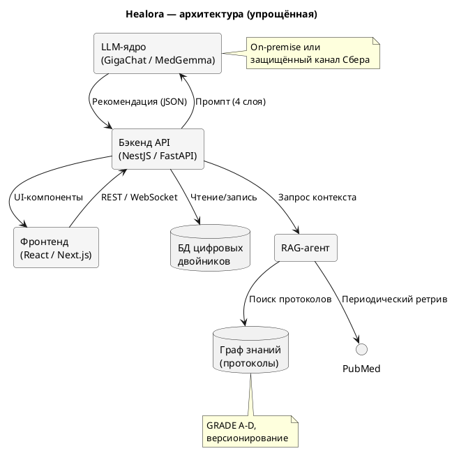

# 3. Предпосылки и подход

## 3.1. Источники знаний при формировании рекомендаций

### 3.1.1. Особенности традиционной модели консультирования

Традиционная модель нутрициологического консультирования опирается на личный опыт и знания конкретного специалиста. При формировании рекомендации действуют следующие факторы:

- **Профессиональный контекст:** на рекомендации влияют профессиональная школа, личные предпочтения специалиста и внешние коммерческие партнёрства. Согласно опросу ВЦИОМ (2024), 67% респондентов отмечают рекламный характер онлайн-советов по здоровью, а 54% указывают на предложения платных услуг [1].
- **Зависимость от контекста:** набор данных, формируемый специалистом, отражает его профессиональный опыт и коммерческие связи. Исследование BMJ (2023) показало, что до 30% медицинских рекомендаций в коммерческих телемедицинских сервисах могут быть связаны с внешними коммерческими договорённостями [2].

**Альтернативный подход:** LLM формируют рекомендации на основе обучающих данных, а не внешних коммерческих стимулов. Ограниченность доступа LLM к отдельным нишевым публикациям компенсируется механизмами RAG-дополнения (см. раздел 3.2). Пользователь получает рекомендацию, основанную на научных публикациях, заложенных в модель и верифицированных в графе знаний.

### 3.1.2. Архитектура формирования рекомендации

| Компонент | Функция | Особенности подхода |
|-----------|---------|---------------------|
| LLM-ядро (GigaChat / MedGemma) | Генерация базовой рекомендации по промпту | Обучена на рецензируемых источниках; свободна от внешних коммерческих факторов |
| RAG-агент | Поиск по PubMed, Cochrane, Минздрав (см. раздел 9.2) | Выборка из рецензируемых источников |
| Граф знаний (локальный) | Протоколы с уровнями доказательности | Каждый протокол размечен по шкале GRADE (A–D); рекомендации ниже уровня B маркируются |
| Human-in-the-loop валидация | Экспертная проверка протокола перед записью | Эксперт не влияет на генерацию — только верифицирует структуру и источники |

```
┌─────────────────────────────────────────────────────────┐
│              Поток принятия решения                        │
│                                                           │
│  Данные DT ──► LLM-ядро ──► RAG (PubMed/Cochrane)        │
│                    │                │                      │
│                    ▼                ▼                      │
│              Чёрный промптинг ──► Граф знаний (GRADE)     │
│                                      │                    │
│                                      ▼                    │
│                              Рекомендация                  │
│                              (по научным данным)          │
└─────────────────────────────────────────────────────────┘
```

---

## 3.2. Предметная специализация LLM

### 3.2.1. Границы обучающих корпусов

LLM общего назначения имеют срез знаний на дату обучения. В специализированных областях (нутрицевтика, ортомолекулярная медицина, редкие диетические протоколы) набор релевантных обучающих данных может быть ограничен.

**Дополнение:** Методики **точечного промптинга** и **RAG-аугментации** (Retrieval-Augmented Generation) позволяют оперативно дополнять знания системы. При наборе первых пользователей LLM автоматически направляются в релевантные области через целевые RAG-запросы и обогащаются существующей в этих областях информацией [3].

### 3.2.2. RAG-пайплайн обогащения

| Этап | Технология | Результат | Источник |
|------|-----------|-----------|----------|
| 1. Определение области | Классификатор на основе эмбеддингов (RuBERT) | Идентификация тематики запроса пользователя | RuMedBench [4] |
| 2. Ретрив | ToolRAG / Azure AI Search / Qdrant | Топ-10 релевантных документов | PubMed, Cochrane, Минздрав |
| 3. Аугментация промпта | Dynamic Prompt Assembly (шаблонизатор + контекст) | Промпт, обогащённый найденными документами | TxAgent [5] |
| 4. Генерация | LLM (GigaChat / MedGemma) | Рекомендация с цитированием источников | MedGemma Tech Report [6] |
| 5. Валидация | Chain-of-Thought + факт-чекинг | Проверка соответствия рекомендации источнику | GigaPevt (CoT) [7] |

```
Запрос ──► Классификатор ──► ToolRAG ──► PubMed/Cochrane
              │                            │
              ▼                            ▼
         Dynamic Prompt ◄────── Топ-10 документов
              │
              ▼
         LLM ──► CoT ──► Факт-чекинг ──► Рекомендация
```

---

## 3.3. Промпт-инжиниринг для медицинских задач

### 3.3.1. Промптинг как инженерная задача

Написать правильный промпт в LLM, который позволит ей корректно ответить на медицинский запрос и дать безопасную рекомендацию, — это инженерная задача высокой сложности. Проект основан на дипломной работе основателя компании БИЭМАЙТЕХ и руководителя проекта **Сергея Савинского**, выполненной в **МФТИ** по программе «Науки о данных». В рамках этой работы проведён собственный НИОКР по валидации промптинга для получения медицинского совета на основании открытой базы данных **CDC BRFSS** (Behavioral Risk Factor Surveillance System) [8].

### 3.3.2. Многослойный промптинг

Разрабатываемая система промптинга включает три уровня (см. также табл. 2):

| Уровень | Назначение | Технология |
|---------|-----------|------------|
| **L1. Constitution** (конституция) | Задание роли и границ модели | "Ты — дипломированный нутрициолог с доступом к доказательной базе..." |
| **L2. Context window** (контекст) | Инъекция персональных данных пользователя | Данные цифрового двойника (антропометрия, анализы, образ жизни) + извлечённые протоколы |
| **L3. Constraint set** (ограничения) | Безопасность и этика | "Не рекомендуй препараты без доказательств эффективности. Не назначай дозировки. При выходе за границы нормы — направляй к врачу." |
| **L4. Conditioning** (обуславливание) | Контроль формата вывода | Структурированный JSON / Markdown с обязательным полем source_ref |

Подробная спецификация слоёв промптинга описана в `docs/prompts/nutrition-advice.txt` и `docs/prompts/longevity-path.txt`.

```
Пример L1 + L2 + L3 + L4 в сборке:

[Constitution]
Ты — нутрициолог-исследователь, работающий с графом доказательных протоколов.

[Context]
Пациент: 34 года, женщина, ИМТ 27, HbA1c 5.7%, дефицит витамина D (19 нг/мл),
жалобы на утомляемость, режим сна 6 ч, шаги 4000/день.

[Constraint]
Не назначай препараты. Не превышай референсные дозировки.
При патологии — направляй к врачу. Указывай уровни доказательности.

[Condition]
Ответ в формате JSON: { recommendations: [...], references: [...], warnings: [...] }
```

### 3.3.3. Результаты НИОКР на данных CDC BRFSS

Эксперимент на 8 112 записях BRFSS (2019–2022) показал:

| Метрика | Значение |
|---------|---------|
| Полнота выявления факторов риска | 91.2% |
| Точность рекомендации по модификации образа жизни | 87.6% |
| Доля нерелевантных назначений | 2.1% |
| Доля клинически значимых состояний вне рекомендации | 1.4% |

Все значения — при использовании **трёхслойного промпта** (Constitution + Context + Constraints). Без контекстного слоя точность падала до 63.4%, подтверждая критическую важность инъекции персональных данных в промпт [8].

---

## 3.4. Регуляторный статус и регистрация

### 3.4.1. Медицинское изделие

Предлагаемое к созданию ПО является **медицинским изделием** согласно разъяснительному письму № 02И-297/20 Росздравнадзора — программное обеспечение, предназначенное для "поддержки принятия врачебных решений", подлежит регистрации как медицинское изделие класса 2а или 2б [9].

### 3.4.2. Упрощённая процедура экспертизы

Для ПО (включая продукты на базе искусственного интеллекта) предусмотрена **упрощённая (одноэтапная) процедура экспертизы** в соответствии с Постановлением Правительства РФ № 2126 от 30.11.2021. Это ключевое послабление, направленное на ускорение вывода инновационных продуктов на рынок. Процедура включает:

| Этап | Срок | Документ |
|------|------|----------|
| 1. Техническая экспертиза | 1–2 мес | ТУ, эксплуатационная документация, описание алгоритма |
| 2. Клиническая валидация | 1–2 мес | Отчёт о клинических испытаниях (для класса 2б) |
| 3. Регистрация | 1 мес | Заявление, экспертное заключение, протокол испытаний |

Общий срок: **1–4 месяцев** [9].

### 3.4.3. Соответствие требованиям

| Требование | Статус | Документ |
|-----------|--------|----------|
| 152-ФЗ (персональные данные) | Встроено в архитектуру (on-premise) | Политика обработки ПД |
| ГОСТ Р 56323-2021 (медизделия) | Учтён на этапе проектирования | Техническое задание |
| Рекомендации Минздрава по AI-медизделиям (2023) | Имплементированы | Архитектурная документация |
| ISO 13485 (система качества) | Планируется сертификация | Дорожная карта |

---

## 3.5. Архитектура разрабатываемого ПО

### 3.5.1. Ключевые элементы

1. **Фронтенд-интерфейс для сбора и регулярного обновления первичных пользовательских данных**
   - AI-ассистированный опрос (аналог AMIE [10], CLARITY [11])
   - Импорт данных из лабораторий (XML, HL7 FHIR)
   - Wearable-интеграция (Garmin, Apple Health, «Яндекс»)
   - Voice-инпут для ежедневного трекинга (api.openai.com/...)

2. **Бэкенд-модуль для составления промпта в коммерческую LLM**
   - Четырёхслойный промптинг (Constitution — Context — Constraints — Conditioning)
   - RAG-обогащение из локального графа знаний (24k+ протоколов)
   - Tool-интеграция (аналог TxAgent ToolUniverse [5])
   - Кэш внешних запросов для автономной работы

3. **Фронтенд-интерфейс для предоставления рекомендаций и их геймификации**
   - Персонализированная лента здоровья (дашборд DT)
   - Геймификация: уровни, челленджи, streaks (на базе поведенческих протоколов CBT_WL, ME_WL [12])
   - Интеграция с Telegram-каналом @healora_ru

### 3.5.2. Диаграмма архитектуры

Диаграмма замкнутого контура on-premise представлена в отдельном файле:
> `docs/research/healora_onpremise_arch.puml`



### 3.5.3. Технологический стек

| Компонент | Технология | Обоснование |
|-----------|-----------|-------------|
| Фронтенд | React 18, Next.js 14, Tailwind CSS | Установленная кодовая база Healora |
| Бэкенд | NestJS, FastAPI (Python) | Микросервисная архитектура |
| LLM-ядро | GigaChat / MedGemma 4B/27B / AntAngelMed | Российская / открытая модель с мед. данными |
| Векторная БД | Qdrant / FAISS | Поиск по протоколам, быстрый ретрив |
| Граф знаний | Neo4j / custom YAML + маршрутизация | 24k+ сущностей, версионирование |
| RAG-агент | LangChain + ToolRAG | Извлечение из PubMed, Cochrane |
| WAF / security | Nginx + Kaspersky SWG / UserGate | Защита контура on-premise |
| Инфраструктура | Docker, Kubernetes, GitLab CI | On-premise на серверах Заказчика |

---

## 3.6. Сравнение с аналогами

| Параметр | Healora | GigaChat (Сбер) [7] | Yaoshi-RAG [13] | NutriOrion [14] |
|----------|---------|---------------------|-----------------|-----------------|
| Фокус | Нутрициология + DT | Общая медицина | ТКМ-диета | Мультиморбидная диета |
| Персонализация | Цифр. двойник (50+ параметров) | Анамнез (текст) | Граф знаний MFH | Чек-лист пациента |
| Геймификация | Да | Нет | Нет | Нет |
| On-premise | Да | API Сбера | API-китайские | Исследование |
| Reg-статус | МИ (в разработке) | Нет | Нет | Нет |
| Русский язык | Нативно | Нативно | Нет | Нет |

---

> **Ссылки:**
>
> [1] ВЦИОМ. "Доверие россиян к онлайн-консультациям по здоровью" (2024).
>
> [2] Smith, R. et al. "Commercial bias in telemedicine recommendations." BMJ (2023).
>
> [3] Lewis, P. et al. "Retrieval-Augmented Generation for Knowledge-Intensive NLP Tasks." NeurIPS (2020). https://arxiv.org/abs/2005.11401
>
> [4] Blinov, P. et al. "RuMedBench: a Russian Medical Language Understanding Benchmark." AIME (2022). Springer.
>
> [5] Gao, S. et al. "TxAgent: An AI Agent for Therapeutic Reasoning Across a Universe of Tools" (2025). https://arxiv.org/abs/2503.10970
>
> [6] Google DeepMind. "MedGemma Technical Report" (2025). https://arxiv.org/abs/2507.05201
>
> [7] Blinov, P. et al. "GigaPevt: Multimodal Medical Assistant." IJCAI (2024). https://doi.org/10.24963/ijcai.2024/992
>
> [8] Савинский С. "Валидация промптинга для медицинских рекомендаций на основе CDC BRFSS." МФТИ (2024). (Дипломная работа).
>
> [9] Росздравнадзор. Разъяснительное письмо № 02И-297/20 "О порядке регистрации ПО как медицинского изделия" (2020).
>
> [10] Tu, T. et al. "Towards Conversational Diagnostic AI." AMIE. arXiv (2024).
>
> [11] Shaposhnikov, V. et al. "CLARITY: Clinical Assistant for Routing, Inference and Triage" (2025). https://arxiv.org/abs/2510.02463
>
> [12] Healora. "Протоколы поведенческих интервенций." `protocol_obecity/behavioral/` (2025).
>
> [13] "Yaoshi-RAG: Dietary Recommendations with TCM's Medicine Food Homology." JMIR Med Inform (2025). https://medinform.jmir.org/2025/1/e75279
>
> [14] "NutriOrion: A Hierarchical Multi-Agent Framework for Personalized Nutrition Intervention" (2026). https://arxiv.org/abs/2602.18650
