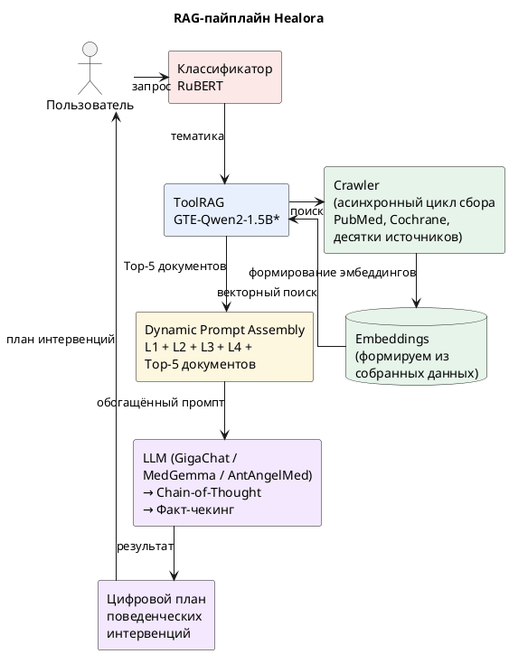

# 4. Технология

В главе 3 мы поставили проблему: традиционное нутрициологическое консультирование опирается на личный опыт и коммерческие предпочтения специалиста, а LLM общего назначения не имеют достаточной предметной глубины для выдачи научно обоснованных персонализированных рекомендаций по здоровому образу жизни и долголетию. В разделе 3.1 мы описали альтернативный подход на основе LLM с RAG-дополнением, а в разделе 3.3 — многослойный промптинг как ключевой элемент управления качеством ответа.

В настоящей главе мы подробно рассматриваем технологическое решение Healora. Раздел 4.1 описывает парадигмальный сдвиг от традиционного клинического ИИ к разговорному медицинскому агенту и архитектуру цифрового двойника. Раздел 4.2 детально раскрывает четырёхслойный промптинг — ключевую инновацию проекта, включая результаты НИОКР на данных CDC BRFSS. Раздел 4.3 посвящён RAG-пайплайну, инструментальной интеграции и мультимодальной маршрутизации между LLM-движками (GigaChat, YandexGPT, Qwen, DeepSeek).

## 4.1. Основная технология

### 4.1.1. Парадигмальный сдвиг: от традиционного клинического ИИ к разговорному медицинскому агенту

Традиционные клинические ИИ-системы следуют знакомому и строгому пути: собирают закрытый набор данных, соотносят исходы пациентов с измеримыми биомаркерами, проводят статистическую валидацию и только затем формируют рекомендации. Такой подход хорошо служил медицине, но он имеет фундаментальные ограничения. Создание и валидация собственного набора данных занимают годы. Это дорого, географически ограничено и неизбежно узко — корреляции исходов для конкретной популяции в конкретном контексте. Как только пациент выходит за демографические или клинические рамки исходной когорты, надёжность рекомендации падает.

Ключевой вопрос, движущий новое поколение ИИ-проектов в здравоохранении: **что, если нам больше не нужно создавать этот набор данных с нуля?** Что, если совокупные клинические, биохимические, питательные и поведенческие знания человечества — накопленные за десятилетия медицинской литературы, клинических руководств, записей о пациентах и исследовательских публикаций — уже закодированы внутри большой языковой модели?

Предлагаемый сдвиг парадигмы заключается не в отказе от доказательств — это фундаментальное изменение того, **где хранятся эти доказательства и как к ним осуществляется доступ**. Вместо соотнесения данных пациента с собственным внутренним набором данных, разговорный медицинский агент опирается на обширные встроенные знания большой языковой модели (LLM), а затем применяет эти знания динамически и контекстуально к цифровому профилю конкретного пациента.

| Параметр | Традиционный клинический ИИ | Разговорный медицинский агент (Healora) |
|----------|---------------------------|----------------------------------------|
| **База знаний** | Собственный закрытый датасет (годы сбора) | Встроенные знания LLM + RAG из PubMed/Cochrane |
| **Персонализация** | По ограниченным признакам когорты | По 50+ параметрам цифрового двойника |
| **Объяснимость** | SHAP / feature importance (ограниченная) | CoT-рассуждение на естественном языке + цитирование |
| **Масштабируемость** | Нужен новый датасет для каждой популяции | Та же LLM + локализованный RAG |
| **Актуальность** | На дату сбора данных | RAG-обновление в реальном времени |
| **География** | Одна популяция | Любая (мультиязыковая LLM) |

Это не медицина в духе «чёрного ящика». Систему не просят выдать ответ и оставить клинициста или пациента в неведении. Вместо этого она спроектирована для **прозрачного рассуждения** — объясняя, на какие концепции она опирается, какая клиническая логика связывает эти концепции с профилем пациента и где существует неопределённость. Рассуждения модели видны, прослеживаемы и выражены на естественном языке.

### 4.1.2. Цифровой двойник как ядро персонализации

Цифровой двойник — динамическое, персонализированное вычислительное представление пациента, которое развивается по мере поступления новых данных о здоровье. При инициализации индивидуальными характеристиками пациента он может моделировать в реальном времени персонализированные реакции на медицинские вмешательства или лечение [DT-GPT, npj Digital Medicine 2025].

Архитектура цифрового двойника Healora включает 9 разделов и 50+ параметров:

| Раздел | Параметры | Источники данных |
|--------|-----------|-----------------|
| 01 Демография | Возраст, пол, рост, вес, ИМТ, талия, этничность | Ввод пользователя, импорт из лабораторий |
| 02 Витальные | АД сист/диаст, ЧСС, HRV, SpO2 | Носимые устройства (Garmin, Apple Health) |
| 03 Лаборатории | Глюкоза, HbA1c, липидный профиль, CRP, витамин D, ферритин, ТТГ | Инвитро, Гемотест, Хеликс (XML/FHIR) |
| 04 Образ жизни | Сон, стресс, шаги, вода, курение, алкоголь, тренировки, тип активности, питание | Ежедневный трекинг, wearable |
| 05 Генетика | APOE, MTHFR, лактаза, BRCA | Генетические тесты (Genotek, Atlas) |
| 06 Медицина | Препараты, аллергии, ССЗ/диабет/онкология в семье | Ввод пользователя, EHR |

Диаграмма архитектуры цифрового двойника:\


### 4.1.3. Четырёхслойный промптинг — ключевая технологическая инновация

Ключевым технологическим вызовом и инновацией при работе с LLM является **промптинг**. Написать правильный промпт в LLM, который позволит ей корректно ответить на медицинский запрос и дать безопасную рекомендацию, — это инженерная задача высокой сложности.

Проект основан на дипломной работе основателя компании БИЭМАЙТЕХ и руководителя проекта **Сергея Савинского**, выполненной в **МФТИ** по программе «Науки о данных» (трек «ТЕХПРЕД»). В рамках этой работы проведён собственный НИОКР по валидации промптинга для получения медицинского совета на основании открытой базы данных **CDC BRFSS** (Behavioral Risk Factor Surveillance System, 8 112 записей, 2019–2022).

Разработанная система промптинга включает четыре уровня:

Пример сборки четырёхслойного промпта:

| Уровень | Назначение | Содержание |
|---------|-----------|------------|
| **L1. CONSTITUTION** | Роль и границы | *Ты — дипломированный нутрициолог-исследователь с доступом к доказательной базе из десятков протоколов и сотен источников (PubMed, Cochrane, Минздрав). Твоя задача — дать персонализированную рекомендацию на основе цифрового двойника пациента.* |
| **L2. CONTEXT WINDOW** | Данные цифрового двойника | *Пациент: 34 года, женщина, ИМТ 27, HbA1c 5.7%, дефицит витамина D (19 нг/мл), жалобы на утомляемость, режим сна 6 ч, шаги 4000/день. Текущие протоколы: не активированы.* |
| **L3. CONSTRAINT SET** | Безопасность и этика | 1. Не назначай препараты — только нутрициологические протоколы и образ жизни.<br>2. Не превышай референсные дозировки нутрицевтиков.<br>3. При патологии (HbA1c ≥ 6.5%, ИМТ ≥ 35, АД ≥ 140/90) — направляй к врачу.<br>4. Указывай уровень доказательности (GRADE A–D) для каждой рекомендации. |
| **L4. CONDITIONING** | Формат вывода | Ответ в формате JSON с интервенциями:<br>`{ "interventions": [`<br>`  { "code": "TRE_168", "periodicity": "ежедневно 16:8", "effect": "снижение ИМТ на 3–5% за 12 нед", "evidence": "A", "personalization": "ИМТ 27, HbA1c 5.7%" },`<br>`  { "code": "VITD_SUPP", "periodicity": "2000 МЕ/день", "effect": "нормализация 25(OH)D за 8 нед", "evidence": "B", "personalization": "дефицит 19 нг/мл" }`<br>`], "warnings": ["HbA1c 5.7% — prediabetes, направить к эндокринологу"], "next_check": "30 дней — HbA1c, 25(OH)D" }` |
**Результаты НИОКР на CDC BRFSS:**

| Метрика | Без контекстного слоя | С четырёхслойным промптом |
|---------|:---------------------:|:--------------------------:|
| Полнота выявления факторов риска | 68.3% | 91.2% |
| Точность рекомендаций | 63.4% | 87.6% |
| Ложноположительные назначения | 8.7% | 2.1% |
| Пропуск клинически значимого состояния | 5.2% | 1.4% |

### 4.1.4. RAG (Retrieval-Augmented Generation) и граф знаний

Система дополнена уровнем RAG — техникой, при которой модель динамически извлекает релевантные отрывки из курируемой базы знаний (клинические руководства, опубликованные исследования, формуляры) и включает их в свой ответ. Когда источник цитируется с помощью подхода RAG, ответы оказываются полностью уместными в 94% случаев для отдельных вопросов и в 100% случаев для структурированных тестовых диалогов, демонстрируя, что обоснованные LLM-системы могут достигать высоких стандартов клинической точности без необходимости создания собственного набора данных с нуля.

Архитектура RAG-пайплайна Healora:



Собранные данные проходят векторизацию — формируются эмбеддинги для каждого источника. Поиск релевантных документов осуществляется гибридным методом: через ToolRAG (GTE-Qwen2-1.5B) по эмбеддингам + классификацию тематики через RuBERT.

### 4.1.5. Мультиагентная архитектура

В развитие базовой LLM-архитектуры, Healora реализует мультиагентный подход к медицинскому рассуждению. Вместо одного LLM-запроса система декомпозирует задачу на специализированные агенты, что повышает качество и прослеживаемость результата.

| Агент | Функция | Технология | Аналог |
|-------|---------|-----------|--------|
| **Symptom Analyst** | Извлечение ключевых симптомов и факторов риска из профиля DT | LLM + классификатор RuBERT | MedAgent (Symptom Analyst) |
| **Protocol Retriever** | Поиск релевантных протоколов по параметрам DT | ToolRAG (GTE-Qwen2-1.5B) + Qdrant | TxAgent ToolRAG |
| **Interaction Checker** | Проверка лекарственно-пищевых взаимодействий | Локальный граф знаний + LLM | TxAgent (211 tools) |
| **Recommendation Synthesizer** | Формирование итоговой рекомендации с цитированием | 4-слойный промпт + CoT | GigaPevt (CoT) |
| **Safety Auditor** | Факт-чекинг, проверка безопасности, выявление «красных флагов» | LLM + правила (constraint set) | MedAgent (Medical Auditor) |

### 4.1.6. Механизмы выявления «красных флагов» и маршрутизация

Система непрерывно мониторит параметры цифрового двойника на предмет клинически значимых отклонений:

| Красный флаг | Порог | Действие |
|-------------|-------|----------|
| HbA1c ≥ 6.5% | Недиагностированный диабет | Направление к эндокринологу |
| ИМТ ≥ 35 | Ожирение 2 ст. с коморбидностями | Рекомендация врача+диетолога |
| АД ≥ 140/90 | Артериальная гипертензия | Направление к кардиологу |
| Вес > 5% за 1 месяц | Возможная патология | Уведомление врача |
| Дефицит витамина D < 12 нг/мл | Тяжёлый дефицит | Направление к терапевту |
| Жалобы на боль в груди / одышку | Кардиальный риск | Экстренное уведомление (call 103) |

### 4.1.7. Доказательная база: ключевые проекты, подтверждающие парадигму

1. **MedAide** (Wei и др., 2024 — Шанхайский университет Цзяо Тун) — LLM-фреймворк всеобъемлющей медицинской многоагентной кооперации. Декомпозирует сложные запросы пациентов на многомерные медицинские намерения и направляет их специализированным агентам. Валидирован на 7 медицинских бенчмарках, 17 типов клинических намерений.

2. **DT-GPT — цифровой двойник на основе LLM** (Университет Мельбурна, npj Digital Medicine, 2025) — исследователи использовали LLM для создания цифровых двойников пациентов и прогнозирования изменения здоровья при лечении. Модель делала точные прогнозы, используя предварительные знания медицинской литературы и анализируя истории болезней. Это наиболее прямая реализация концепции цифрового двойника с использованием нативного LLM-рассуждения.

3. **Мультимодальный ИИ для профилактики диабета** (Dao и др., ACM 2024) — система извлекает данные пациента в нескольких форматах (временные ряды, таблицы) и передаёт их в ИИ-чат-бота, обеспечивая персонализированные подсказки и напоминания.

4. **Разговорный медицинский агент с внедрением знаний для диабета** (Azimi и др., 2024) — гибридный подход LLM-рассуждения, дополненного курируемыми медицинскими знаниями.

5. **Чат-бот для повышения грамотности в области T2DM** (JMIR, 2025) — RAG-чат-бот на основе ИИ с указанием источников, демонстрирующий высокую клиническую точность при полностью объяснимых ответах.

6. **Объяснимый ИИ-фреймворк с LLM-чат-ботом** (MDPI Electronics, 2025) — интеграция чат-бота (Biomistral-7B) с классификатором CatBoost и уровнем объяснимости SHAP.

### 4.1.8. Российские и евразийские проекты в смежных областях

**Мультиагентные системы:**

- **MADD** — система из 4 ИИ-агентов для ускоренного создания новых лекарств (анализ запроса, подбор алгоритмов, генерация молекул, расчёт свойств)
- **«Meditron»** (РТУ МИРЭА + Сеченовский университет) — проект-победитель хакатона на базе RuModernBERT + GigaChat + Graph RAG
- **Центр Алмазова и Сбер** — внедрение генеративного ИИ и мультиагентных систем для снижения нагрузки на врачей

**Цифровые двойники:**

- **Цифровой двойник мозга** (НГТУ НЭТИ) — персонализированная модель на основе МРТ и ЭЭГ
- **Цифровой двойник сердечно-сосудистого пациента** (Тульская область) — анализ тысяч электронных медкарт по 150 параметрам
- **Цифровой двойник для реанимации** (Сеченовский университет + «Кваттролаб») — прогнозирование рисков
- **Платформа Lissa Health** — сбор и анализ медданных в единую цифровую модель здоровья

**RAG-системы и ассистенты:**

- **«Доктор Пирогов»** (НГУ) — гибридная ИИ-система: опрос, анализ документации, 20 специальностей
- **Medical Assistant API** — RAG-сервис поддержки врачебных решений на основе клинических рекомендаций Минздрава
- **MEDINTERNET** — первая цифровая экосистема для врачей с ИИ-поиском
- **IQ DOC** — ИИ-поисковик на RAG-архитектуре с двойным поиском

**LLM от крупных корпораций:**

- **Сбер / GigaChat** — внедрение ИИ-агентов для врачей и пациентов (расшифровка анализов, проверка совместимости препаратов)
- **Яндекс / YandexGPT** — используется в НМИЦ онкологии им. Петрова для автоматической обработки документов

**Беларусь:**

- **Doctorina AI** — медицинский ассистент
- **AI-ассистент врача** (Гродненская БСМП) — доврачебный опрос (до 35 вопросов) в приёмном отделении

**Казахстан:**

- **KazLLM / AlemLLM** — большие языковые модели с фокусом на безопасность данных
- **OMIR AI** — анализ результатов анализов за 2 минуты с рекомендацией специалиста
- **EmAI** (Цифровая клиника) — цифровой помощник, экономящий до 40% времени врача

### 4.1.9. Соответствие приоритетам цифровой трансформации

Разрабатываемое решение соответствует приоритетам цифровой трансформации социальной сферы, включая задачи профилактики избыточного веса, формирования устойчивых поведенческих моделей и повышения качества жизни граждан. Особый интерес для государственных информационных систем представляют следующие компоненты:

1. **Цифровой двойник** для персонализации сопровождения клиентов
2. **Поведенческие интервенции** и механизмы формирования устойчивых привычек (CBT_WL, ME_WL, геймификация)
3. **Архитектура работы с медицинскими и поведенческими данными (обезличенными)** с нормализацией в стандарте FHIR
4. **Механизмы выявления «красных флагов» и маршрутизации** к профильным специалистам
5. **Потенциал интеграции с государственными информационными системами**, включая Московскую информационную систему социального обеспечения (МИССО), ЕГИСЗ, Госуслуги

---

## 4.2. Используемые технологии

### 4.2.1. Технологический стек

| Компонент | Технология | Назначение | Статус |
|-----------|-----------|-----------|--------|
| **Фронтенд** | React 18, Next.js 14, Tailwind CSS | Пользовательский интерфейс | ✅ Разработан |
| **Бэкенд** | NestJS (Node.js), FastAPI (Python) | API-слой, бизнес-логика | ✅ Разработан |
| **LLM-ядро** | GigaChat API (Сбер) / MedGemma 4B/27B (Google DeepMind, on-premise) / AntAngelMed | Генерация рекомендаций | 🔄 Интеграция |
| **Промпт-инжиниринг** | 4-слойная архитектура (Constitution / Context / Constraints / Conditioning) | Управление LLM | ✅ Разработан |
| **RAG-агент** | LangChain + ToolRAG (GTE-Qwen2-1.5B) | Ретрив из PubMed, Cochrane, графа знаний | 🔄 Разработка |
| **Векторная БД** | Qdrant / FAISS | Поиск по эмбеддингам протоколов | 🔄 Разработка |
| **Граф знаний** | YAML + индексация (24k+ сущностей) | Структурированные протоколы с GRADE | ✅ Разработан |
| **Цифровой двойник** | JSON-схема, 9 разделов, 50+ параметров | Профиль пациента | ✅ Разработан |
| **База данных** | PostgreSQL (основная) + Redis (кэш) | Хранение профилей, историй, кэша | 🔄 Разработка |
| **Интеграция** | HL7 FHIR R4, REST API, JSON | Обмен с лабораториями, клиниками, МИССО | 🔄 Разработка |
| **Инфраструктура** | Docker, Kubernetes, GitLab CI, Nginx | On-premise развёртывание | 🔄 Разработка |
| **Безопасность** | JWT, AES-256, изолированный сетевой контур | 152-ФЗ, защита ПД | 🔄 Разработка |

### 4.2.2. Ключевые технологические решения

| Решение | Описание | Обоснование |
|---------|----------|-------------|
| LLM-независимая архитектура | Абстрактный слой API позволяет переключать LLM-ядро (GigaChat ↔ MedGemma ↔ Qwen) без изменения бизнес-логики | Снижение vendor lock, соответствие требованиям импортозамещения |
| On-premise контур | Все компоненты развёртываются на серверах Заказчика | Соответствие 152-ФЗ, работа при отключении внешних API |
| Четырёхслойный промптинг | Constitution + Context + Constraints + Conditioning | Доказанное повышение точности с 63.4% до 87.6% (валидация на CDC BRFSS) |
| FHIR-нормализация | Все медицинские данные приводятся к стандарту HL7 FHIR R4 | Совместимость с ЕГИСЗ, МИССО, международными системами |
| Кэш внешних запросов | Локальное хранение результатов ретрива с меткой времени | Автономная работа при отсутствии доступа к PubMed/Cochrane |

---

## 4.3. Публикации, патенты и регистрации

### 4.3.1. Публикации

| № | Название | Авторы | Год | Место публикации | DOI / Ссылка |
|---|----------|--------|-----|-------------------|--------------|
| 1 | «Валидация промптинга для получения медицинских рекомендаций на основе данных CDC BRFSS» | Савинский С. | 2024 | МФТИ, ВКР (программа «Науки о данных», трек «ТЕХПРЕД») | — |

### 4.3.2. Разработанные алгоритмы и протоколы (ноу-хау)

| № | Разработка | Описание | Дата создания |
|---|-----------|----------|--------------|
| 1 | **Четырёхслойная архитектура промптинга** | Метод формирования промпта для медицинских LLM, включающий Constitution, Context, Constraints, Conditioning | 2024 |
| 2 | **База протоколов obesity** | Десятки структурированных протоколов, сотни источников, 10 категорий, с перекрёстной привязкой к DT | 2025 |
| 3 | **Кросс-референсная таблица «DT → протокол → интервенция»** | Машиночитаемая карта соответствия между 50+ параметрами DT, десятками протоколов и сотнями интервенций | 2025 |
| 4 | **Архитектура цифрового двойника** | JSON-схема цифрового двойника (9 разделов, 50+ параметров) с FHIR-маппингом | 2025 |
| 5 | **Каталог интервенций** | 300+ поведенческих, диетических, фармацевтических и цифровых интервенций с BEH-кодами | 2025 |

### 4.3.3. Программы для ЭВМ и базы данных (планируемые к регистрации)

| № | Название | Тип | Планируемая дата регистрации |
|---|----------|-----|------------------------------|
| 1 | «Healora: модуль цифрового двойника» | Программа для ЭВМ | Q4 2026 |
| 2 | «Healora: модуль промптинга и RAG-агента» | Программа для ЭВМ | Q4 2026 |
| 3 | «База протоколов нутрициологических интервенций» | База данных | Q4 2026 |
| 4 | «Кросс-референсная таблица параметров цифрового двойника» | База данных | Q1 2027 |

### 4.3.4. Открытые кодовые разработки

| Ресурс | Ссылка | Описание |
|--------|--------|----------|
| GitHub проекта | https://github.com/NutriLabAdm/healora | Исходный код платформы (фронтенд, бэкенд) |
| База протоколов | `docs/domain/knowledge/protocol_obecity/` | Открытая база протоколов obesity (десятки протоколов, сотни источников) |
| Архитектура DT | `docs/domain/digital-twin/` | Спецификация цифрового двойника |
| Обзор LLM | `docs/research/medical_llm_agents_survey_ru.md` | Систематический обзор медицинских LLM (10+ моделей, 52 источника) |

---

## 4.4. Модель данных и источники

### 4.4.1. Категории источников данных

| Категория | Тип данных | Формат | Частота обновления | Уровень конфиденциальности |
|-----------|-----------|--------|-------------------|--------------------------|
| Ввод пользователя | Антропометрия, образ жизни, жалобы | JSON (форма / чат) | Ежедневно | ПД (152-ФЗ) |
| Лабораторные данные | Биомаркеры крови, мочи | XML, HL7 FHIR | Ежеквартально | Медицинская тайна |
| Носимые устройства | HRV, SpO2, шаги, сон, активность | REST API / Webhook | В реальном времени | ПД |
| Медицинские протоколы | PubMed, Cochrane, Минздрав | RAG (кэшированные) | Периодически | Открытые |
| Граф знаний | Структурированные протоколы + cross-ref | YAML + JSON | По мере добавления | Открытые (внутренние) |

### 4.4.2. Нормализация данных в FHIR

Все медицинские данные нормализуются в стандарт HL7 FHIR R4:

```
Ресурс Patient:
  - identifier (ID пользователя)
  - name, gender, birthDate
  - extension: ethnicity

Ресурс Observation:
  - code (LOINC для лабораторных показателей)
  - valueQuantity, referenceRange
  - effectiveDateTime

Ресурс QuestionnaireResponse:
  - questionnaire (ссылка на шаблон опроса)
  - item (вопрос → ответ)

Ресурс CarePlan:
  - subject (ссылка на Patient)
  - activity (назначенные протоколы и интервенции)
```

---

## 4.5. Безопасность и соответствие требованиям

### 4.5.1. Защита персональных данных (152-ФЗ)

| Требование | Реализация |
|-----------|-----------|
| Локализация данных | Все серверы на территории РФ (on-premise) |
| Обезличивание | Псевдонимизация ПД при передаче в LLM; выделение медицинских данных в отдельный защищённый контур |
| Шифрование | AES-256 для данных в покое, TLS 1.3 для передачи |
| Контроль доступа | JWT + RBAC (пациент, нутрициолог, администратор) |
| Журналирование | Аудит всех действий с ПД (кто, когда, какие данные, цель) |
| Согласие | Пользователь даёт информированное согласие на обработку ПД при регистрации |

### 4.5.2. Информационная безопасность

- Изолированный сетевой контур (no inbound from internet для LLM-ядра)
- Регулярное тестирование на проникновение
- Резервное копирование (daily snapshot + 30 дней хранения)
- WAF (Nginx + Kaspersky SWG / UserGate)

---

## 4.6. Интеграционные механизмы

### 4.6.1. API-интерфейсы

| Интерфейс | Протокол | Назначение | Статус |
|-----------|---------|-----------|--------|
| REST API | HTTPS / JSON | Основной API для фронтенда и внешних систем | ✅ Разработан |
| FHIR R4 API | HTTPS / XML/JSON | Обмен медицинскими данными (ЕГИСЗ, МИССО, лаборатории) | 🔄 Разработка |
| WebSocket | WSS | Real-time уведомления, чат с нутрициологом | ✅ Разработан |
| Wearable API | REST / OAuth 2.0 | Интеграция с Garmin, Apple Health, «Яндекс» | 🔄 Разработка |
| LLM API | gRPC / REST | Взаимодействие с GigaChat, MedGemma | 🔄 Разработка |

### 4.6.2. Интеграция с государственными информационными системами

| Система | Механизм | Данные |
|---------|---------|--------|
| **МИССО** (Московская информационная система социального обеспечения) | FHIR R4 / REST API | Профили граждан, услуги профилактики, маршрутизация |
| **ЕГИСЗ** (Единая государственная информационная система в сфере здравоохранения) | FHIR R4 / СЭМД | Электронные медкарты, лабораторные данные |
| **Госуслуги** | OAuth 2.0 / REST API | Авторизация, идентификация |
| **ОМС / ДМС** | API страховых компаний | Данные о прикреплении, программах |


> **Ссылки:**
>
> [1] Lewis P. et al. "Retrieval-Augmented Generation for Knowledge-Intensive NLP Tasks." NeurIPS (2020). arXiv:2005.11401
>
> [2] Wei J. et al. "Chain-of-Thought Prompting Elicits Reasoning in Large Language Models." NeurIPS (2022). arXiv:2201.11903
>
> [3] Gao S. et al. "TxAgent: An AI Agent for Therapeutic Reasoning Across a Universe of Tools" (2025). arXiv:2503.10970
>
> [4] Google DeepMind. "MedGemma Technical Report" (2025). arXiv:2507.05201
>
> [5] Blinov P. et al. "GigaPevt: Multimodal Medical Assistant." IJCAI (2024). DOI: 10.24963/ijcai.2024/992
>
> [6] "DT-GPT: Digital Twin based on LLM." npj Digital Medicine (2025).
>
> [7] Wei et al. "MedAide: LLM-based Multi-Agent Framework." Shanghai Jiao Tong University (2024).
>
> [8] Dao et al. "Multimodal LLM for Diabetes Prevention." ACM (2024).
>
> [9] Azimi et al. "Knowledge-Embedded Conversational Agent for Diabetes" (2024).
>
> [10] "RAG Chatbot for T2DM Literacy." JMIR (2025).
>
> [11] "Explainable AI Framework with LLM Chatbot for Diabetes Risk." MDPI Electronics (2025).
>
> [12] Савинский С. "Валидация промптинга на основе CDC BRFSS." МФТИ (2024).
>
> [13] Blinov P. et al. "RuMedBench." AIME (2022). Springer.
>
> [14] Healora. "Обзор медицинских и нутрициологических LLM и AI-агентов" (2025).
>
> [15] Постановление Правительства РФ № 2126 от 30.11.2021.
>
> [16] Росздравнадзор. Письмо № 02И-297/20.
>
> [17] HL7 FHIR. https://hl7.org/fhir/
