# 8. Функциональный прототип и план развития

---

## 8.1. Функциональный прототип Healora Digital Twin

На момент подачи заявки разработан и развёрнут **функциональный прототип** платформы Healora:

| Ресурс | URL |
|--------|-----|
| Продуктивная среда | [healora.ru/digital-twin/](https://healora.ru/digital-twin/) |
| Стенд разработки | [dev.healora.ru/digital-twin/](https://dev.healora.ru/digital-twin/) |
| GitHub | [github.com/NutriLabAdm/healora](https://github.com/NutriLabAdm/healora) |

Прототип представляет собой React SPA (Vite 4) с Node.js/Express бэкендом, взаимодействующим с GigaChat API. Ключевые метрики:

| Метрика | Значение |
|---------|---------|
| Параметров цифрового двойника | 50+ (9 разделов) |
| Протоколов в базе знаний | 21 (19 завершённых + 2 драфта) |
| Научных источников | 99 (peer-reviewed, 2020–2026) |
| Кодов интервенций | 300+ |
| Точность AI-рекомендаций | 87.6% (валидация на CDC BRFSS, 8 112 записей) |
| Поддерживаемых языков распознавания | 8 |

### 8.1.1. Технологический стек

| Компонент | Технология |
|-----------|-----------|
| Фронтенд | React 18, Vite 4, React Router 6 |
| Бэкенд | Node.js 20, Express |
| AI-ядро | GigaChat API (4-слойный промптинг) |
| Хранилище | JSON-файл (прототип), PostgreSQL (планируется) |
| Развёртывание | nginx → Node.js :3000, Let's Encrypt SSL |
| Сервер | 4 vCPU, 8 GB RAM (Beget) |

---

## 8.2. 10 основных экранов приложения

### Экран 1. Выбор профиля (UserAvatarPanel)

**URL:** `/` или `/digital-twin` (левая панель)

Каталог цифровых двойников — стартовая точка приложения. Пользователь видит список профилей с аватаром, именем, возрастом, индексом массы тела, артериальным давлением, звёздами и индикатором риска (зелёный/жёлтый/красный). Клик выбирает профиль и загружает его параметры из API. Адресная строка обновляется: `#TEST_002`.

| Элемент | Описание |
|---------|----------|
| Карточка профиля | Фото, имя, возраст, ИМТ, АД, звёзды, бейдж риска |
| Селектор фото | Модальное окно с 28+ персонажами, смена аватара |
| Индикатор статуса | Зелёный/оранжевый/красный кружок по уровню риска |

> **[скриншот экрана 1](docs/images/screen_01_avatar_panel.png)** — вставьте скриншот левой панели со списком профилей

---

### Экран 2. Дашборд Digital Twin (таблица атрибутов)

**URL:** `/` или `/digital-twin` (центральная панель)

Основной рабочий экран. Таблица с 50+ параметрами, сгруппированными в 6 разделов. Каждая строка содержит код, название, исходное значение, текущее (редактируемое), цель, норму, бейджи интервенций и 7 колонок истории.

| Раздел | Цвет | Параметры |
|--------|------|-----------|
| Демография | Фиолетовый | возраст, пол, рост, вес, ИМТ, талия, этнос |
| Витальные | Синий | АД сист./диаст., ЧСС, HRV, SpO2 |
| Лаборатории | Голубой | глюкоза, HbA1c, холестерин, ЛПНП, ЛПВП, ТГ, СРБ, вит.D, ферритин, ТТГ |
| Образ жизни | Зелёный | сон, стресс, шаги, вода, курение, алкоголь, активность |
| Генетика | Фиолетовый | APOE, MTHFR, лактаза, BRCA |
| Медицина | Красный | лекарства, аллергии, CVD, диабет, онкология |

| Элемент | Описание |
|---------|----------|
| Inline-редактирование | Двойной клик → ввод → Enter/Blur → автосохранение |
| Целевые кнопки | +/- для корректировки цели, прямой ввод |
| Интервенционные бейджи | Ховер показывает связанные протоколы с impact score |
| 7-дневная история | Колонки: сегодня + 6 предыдущих дней |
| Алерты | Подсветка при отклонении >15% от цели |
| Секции сворачиваются | По клику на заголовок |

> **[скриншот экрана 2](docs/images/screen_02_dashboard.png)** — вставьте скриншот таблицы атрибутов с 2–3 развёрнутыми разделами

---

### Экран 3. Таймлайн интервенций (DAW-плеер)

**URL:** `/` или `/digital-twin` (вкладка «Интервенции»)

DAW-инспирированный плеер (по аналогии с цифровой звуковой рабочей станцией). Протоколы и интервенции располагаются на треках с шкалой времени. Красный playhead показывает текущий день.

| Элемент | Описание |
|---------|----------|
| Переключатель вкладок | Протоколы / Интервенции |
| Панель управления | Clear, Start/Stop, Speed (1x/2x/5x/10x), счётчик дня |
| Переключатель вида | 1д / 1н / Фазы |
| Playhead | Перетаскиваемый красный маркер, прыжок по клику |
| Треки | Иконка категории + название + SVG-линия с точками дней |
| Drag-and-drop | Интервенции из каталога перетаскиваются на треки |
| Точки активации | Кружки по дням: заливка = активировано, контур = запланировано |

> **[скриншот экрана 3](docs/images/screen_03_timeline.png)** — вставьте скриншот таймлайна с треками и playhead

---

### Экран 4. Голосовой редактор параметров (Voice Popup)

**URL:** попап из дашборда (кнопка микрофона в заголовке секции)

Модальное окно для заполнения параметров голосом. Использует Web Speech API (8 языков). Пользователь нажимает «Начать запись», диктует значения, система парсит транскрипт и заполняет форму.

| Элемент | Описание |
|---------|----------|
| Кнопка «Начать запись» | Большая фиолетовая кнопка с микрофоном |
| Пульсирующая анимация | Во время записи — круговой пульс |
| Tранскрипт в реальном времени | Текстовая область, редактируется |
| Форма полей | Все параметры раздела как input'ы, подсветка распознанных |
| Микрофонные настройки | Выбор языка (8), выбор устройства, уровень сигнала |
| По-полевая кнопка | Микрофон рядом с каждым полем для индивидуальной диктовки |

> **[скриншот экрана 4](docs/images/screen_04_voice_popup.png)** — вставьте скриншот голосового редактора с открытой формой полей

---

### Экран 5. AI-Чат (GigaChat Assistant)

**URL:** `/chat`

Полноэкранный чат-интерфейс с AI-ассистентом на базе GigaChat. Чат имеет контекст профиля, боковую панель источников данных и журнал действий.

| Элемент | Описание |
|---------|----------|
| Сообщения AI | Аватар + текст, с поддержкой форматирования |
| Сообщения пользователя | Выравнивание вправо, с временем отправки |
| Поле ввода + кнопка | Текстовый ввод, кнопка «Отправить» |
| Боковая панель | «Источники данных» (6 источников) + «Журнал действий» |
| Карточки-задачи | Clickable, переключают статус выполнения |
| Викторина (Quiz) | Полноэкранный оверлей с вопросами, опциями, результатом |
| Интеграция с GigaChat | POST /api/chat с контекстом профиля |

> **[скриншот экрана 5](docs/images/screen_05_chat.png)** — вставьте скриншот чата с несколькими сообщениями

---

### Экран 6. Дневник питания (Food Diary)

**URL:** попап из дашборда (кнопка «Дневник»)

Модальное окно трекинга питания на выбранный день. Четыре приёма пищи с детальным вводом КБЖУ, фото, описанием и голосовым вводом.

| Элемент | Описание |
|---------|----------|
| Навигация по дням | `◀ Day X ▶` |
| 4 приёма пищи | Завтрак, обед, ужин, перекус — каждый с временем |
| КБЖУ | Калории, белки, жиры, углеводы на каждый приём |
| Селектор продуктов | Поиск по 1000+ записей, категорийные фильтры |
| Фото приёма | Загрузка из селектора или камеры |
| Голосовой ввод | Описание приёма голосом |
| Аудио-загрузка | .mp3/.wav для консультаций |
| Самочувствие | Слайдеры: вода, энергия, настроение, сон, стресс, пищеварение |

> **[скриншот экрана 6](docs/images/screen_06_diary.png)** — вставьте скриншот дневника с заполненным приёмом пищи

---

### Экран 7. Каталог интервенций (Interventions Panel)

**URL:** правая панель дашборда (всегда видна)

Библиотека из 300+ поведенческих протоколов и интервенций с evidence level, категориями и drag-and-drop на таймлайн.

| Элемент | Описание |
|---------|----------|
| Фильтры | Категория (питание, сон, активность, ментальное, мед., добавки) |
| Карточка протокола | Название, категория, бейджи кодов интервенций |
| Evidence level | A–D с цветовой индикацией |
| Drag-and-drop | Перетаскивание на таймлайн |
| Попап деталей | Полное описание, impact, regularity, schedule, источники |

> **[скриншот экрана 7](docs/images/screen_07_interventions.png)** — вставьте скриншот правой панели с открытой карточкой протокола

---

### Экран 8. Рецепт / План (Prescription)

**URL:** попап из дашборда (кнопка плана)

Полноценный рецепт HEALORA Prescription с информацией о пациенте, выбранных протоколах, расписании и QR-кодом для пациента.

| Элемент | Описание |
|---------|----------|
| Шапка рецепта | Пациент, врач, дата, длительность |
| Селектор шаблона | Выпадающий список из plan_templates.js |
| Таблица назначений | №, интервенция, код, периодичность, расписание |
| Заметка врача | Текстовая область |
| Статус | Active / Stopped / Archived |
| QR-код | Ссылка на план в приложении |
| Кнопки | Save, Stop/Resume, Archive, Send |
| Печать | Print styles для PDF |

> **[скриншот экрана 8](docs/images/screen_08_prescription.png)** — вставьте скриншот рецепта с таблицей и QR-кодом

---

### Экран 9. Путь здоровья (Progress Path)

**URL:** `/path`

Экран путешествия пользователя с прогрессом, дроп-зоной для устройств, состоянием цифрового двойника и рекомендованными интервенциями.

| Элемент | Описание |
|---------|----------|
| Хедер | Лого, звёзды (840), прогресс (68%), streak (5 дней), уровень |
| Селектор профилей | Сетка карточек DT, множественный выбор |
| Статистика | Дней в пути, этап, общий прогресс % |
| Рекомендации | Три карточки (ментальное, физическое, образ жизни) |
| DeviceDropZone | Область для дропа данных с носимых устройств |
| Состояние DT | 5 индикаторов: энергия, фокус, стресс, сон, настроение |

> **[скриншот экрана 9](docs/images/screen_09_progress_path.png)** — вставьте скриншот экрана «Путь здоровья» с прогресс-баром и дроп-зоной

---

### Экран 10. Подбор протокола (Decision Flow)

**URL:** `/flow`

Интерактивный decision flow симулятор, который анализирует параметры цифрового двойника, ранжирует 9 протоколов по вероятности успеха (pSuccess) и проводит пользователя через сбор дополнительных данных к выбору протокола.

| Элемент | Описание |
|---------|----------|
| Хедер | Градиент фиолетовый, кнопка назад, вероятность успеха, заполненность DT |
| Приветствие | «Анализ ваших данных... Параметры DT загружены» |
| Текущие метрики | ИМТ, АД, сон, стресс, ЛПНП, ЛПВП — с цветовой индикацией |
| Top-3 протокола | Медали 1–3, название, категория, вероятность, персонализация |
| Запрос данных | Запрашивает HbA1c, глюкозу, СРБ и др. с impact-оценкой |
| Инпут данных | Числовое поле + «Подтвердить» / «Пропустить» |
| Подтверждение выбора | Зелёный прогресс-бар, evidence level |
| Системный лог | Консоль с timestamp-сообщениями |

> **[скриншот экрана 10](docs/images/screen_10_decision_flow.png)** — вставьте скриншот decision flow с Top-3 протоколами

---

## 8.3. 5 основных Use Cases

### UC-01: Заполнение цифрового двойника

| Аспект | Описание |
|--------|----------|
| **Actor** | Пользователь (B2C) |
| **Trigger** | Пользователь открывает дашборд, выбирает профиль |
| **Flow** | 1. Система загружает профиль из API (GET /api/profiles/:id) |
| | 2. Пользователь нажимает кнопку микрофона в разделе «Витальные» |
| | 3. Открывается голосовой редактор |
| | 4. Пользователь говорит: «Давление 120 на 80, пульс 72, сатурация 98» |
| | 5. Система распознаёт, парсит значения, заполняет поля |
| | 6. Пользователь вручную корректирует вес: «85» |
| | 7. ИМТ пересчитывается автоматически |
| | 8. Пользователь нажимает «Сохранить» |
| | 9. Система отправляет PUT /api/profiles/:id, обновляет историю |
| **Result** | Цифровой двойник заполнен, история сохранена на сервере |

### UC-02: Получение AI-рекомендации

| Аспект | Описание |
|--------|----------|
| **Actor** | Пользователь (B2C) |
| **Trigger** | Пользователь открывает чат (/chat) и задаёт вопрос |
| **Flow** | 1. Система загружает контекст профиля (параметры DT) |
| | 2. Пользователь пишет: «Что мне улучшить в питании?» |
| | 3. Система отправляет POST /api/chat с сообщением + контекст |
| | 4. GigaChat формирует ответ через 4-слойный промптинг |
| | 5. Пользователь получает персонализированную рекомендацию |
| | 6. Дополнительно: система предлагает викторину для проверки знаний |
| **Result** | Пользователь получает рекомендацию с учётом всех 50+ параметров DT |

### UC-03: Планирование интервенций

| Аспект | Описание |
|--------|----------|
| **Actor** | Пользователь / Врач |
| **Trigger** | Пользователь открывает вкладку «Интервенции» на таймлайне |
| **Flow** | 1. Пользователь видит каталог 300+ интервенций с evidence level |
| | 2. Фильтрует по категории «Питание» |
| | 3. Выбирает протокол «Средиземноморская диета» |
| | 4. Перетаскивает его на таймлайн (drag-and-drop) |
| | 5. Система размещает трек с точками-днями |
| | 6. Пользователь настраивает расписание, день старта |
| | 7. Запускает симуляцию (play) |
| | 8. Playhead движется, треки подсвечиваются |
| | 9. Пользователь сохраняет план |
| **Result** | План интервенций создан, отображается на таймлайне |

### UC-04: Трекинг питания

| Аспект | Описание |
|--------|----------|
| **Actor** | Пользователь (ежедневно) |
| **Trigger** | Пользователь нажимает «Дневник» в хедере дашборда |
| **Flow** | 1. Система открывает модалку дневника для текущего дня |
| | 2. Пользователь вводит завтрак: ищет «овсянка» в селекторе |
| | 3. Система подставляет КБЖУ из базы (1000+ продуктов) |
| | 4. Пользователь корректирует порцию, добавляет фото |
| | 5. Повторяет для обеда, ужина, перекуса |
| | 6. Регулирует слайдер воды (1500 мл) |
| | 7. Оценивает самочувствие (энергия 4/5, настроение 5/5) |
| | 8. Нажимает «Сохранить» — POST /api/diary |
| | 9. Система подтверждает сохранение |
| **Result** | Дневной рацион зафиксирован, доступен в истории |

### UC-05: Подбор протокола через Decision Flow

| Аспект | Описание |
|--------|----------|
| **Actor** | Новый пользователь (пилот) |
| **Trigger** | Пользователь переходит на /flow |
| **Flow** | 1. Система загружает параметры DT (17 полей) |
| | 2. Вычисляет pSuccess для 9 протоколов (ElasticNet + веса) |
| | 3. Показывает Top-3: «Средиземноморская диета» (78%), «DASH» (72%), «16:8» (65%) |
| | 4. Пользователь кликает «Средиземноморская диета» |
| | 5. Система: «Не хватает HbA1c для точного подбора. Введите значение.» |
| | 6. Пользователь вводит «5.4» |
| | 7. Система пересчитывает, подтверждает выбор |
| | 8. Пользователь нажимает «К дашборду» |
| **Result** | Протокол выбран, добавлен на таймлайн |

---

## 8.4. 5 Customer Journey Maps

Каждая CJM представлена в виде PlantUML-диаграммы (swimlane). Диаграммы сгенерированы и доступны в директории `docs/development/`.

### CJM-01: Новый пользователь (B2C)

**Файл:** `docs/development/08.01_cjm_new_user.puml`

**Фазы:** Регистрация → Выбор профиля → Заполнение параметров → Получение рекомендации → План действий
**Участники:** Пользователь, Система

**Ключевые точки:**
- Автоматический редирект на дашборд после регистрации
- Выбор из каталога цифровых двойников (10+ профилей)
- Первая AI-рекомендация формируется сразу после заполнения DT
- QR-код с планом для мобильного доступа

### CJM-02: Активный пользователь (Pro)

**Файл:** `docs/development/08.02_cjm_active_user.puml`

**Фазы:** Ежедневный трекинг → Просмотр прогресса → Корректировка целей → Чат с AI
**Участники:** Пользователь, Система

**Ключевые точки:**
- Поиск по базе продуктов (1000+ записей)
- Goal Chat визард с выбором до 3 целей
- GigaChat-рекомендация с учётом профиля

### CJM-03: Пациент клиники (B2B)

**Файл:** `docs/development/08.03_cjm_clinic_patient.puml`

**Фазы:** Приём у врача → Получение плана → Выполнение → Отчёт врачу
**Участники:** Пациент, Врач, Система

**Ключевые точки:**
- Врач создаёт DT пациента в системе
- QR-код генерируется автоматически
- История выполнения синхронизируется с сервером
- Врач видит adherence в реальном времени

### CJM-04: Врач / нутрициолог

**Файл:** `docs/development/08.04_cjm_doctor.puml`

**Фазы:** Создание плана → Мониторинг → Анализ → Корректировка
**Участники:** Врач, Система

**Ключевые точки:**
- Каталог 300+ протоколов с evidence-level
- Подсветка отклонений >15% от цели
- Экспорт отчёта как .txt
- Сохранение изменений через PUT /api/profiles

### CJM-05: Пользователь на пилоте

**Файл:** `docs/development/08.05_cjm_pilot_user.puml`

**Фазы:** Онбординг/подбор протокола → Настройка таймлайна → Ежедневное выполнение → Контрольная точка
**Участники:** Пользователь, Система

**Ключевые точки:**
- Decision flow ранжирует 9 протоколов по pSuccess
- Drag-and-drop на таймлайн
- Начисление звёзд за выполнение
- Скачивание истории как .txt

---

## 8.5. Визуальные материалы

### 8.5.1. Карта Customer Journey Maps

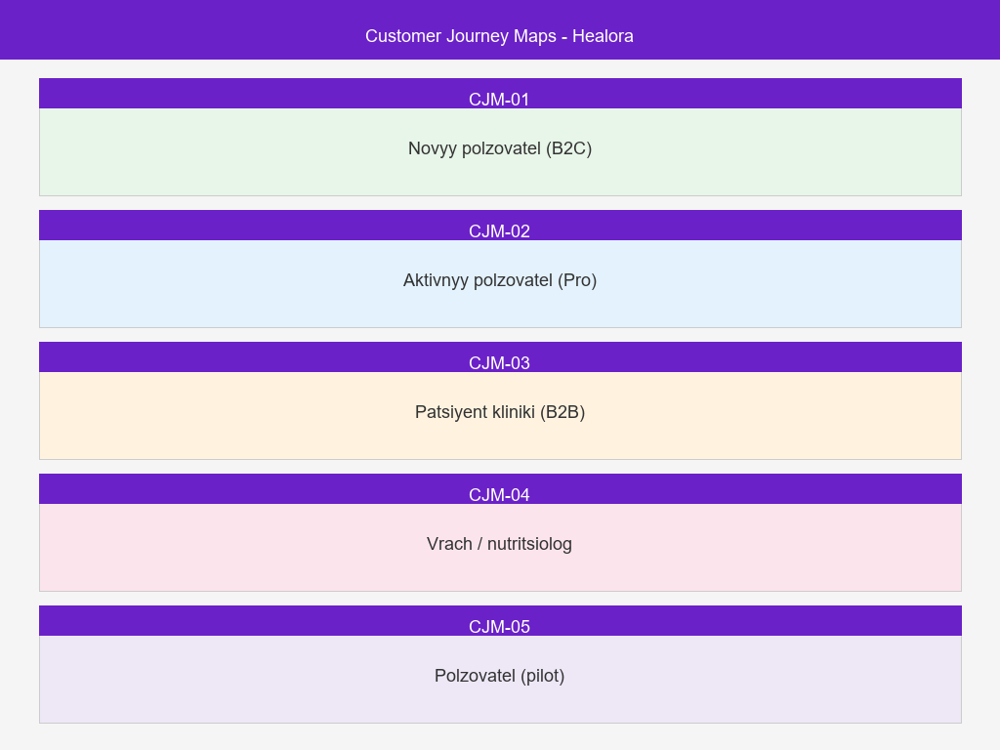

*Сводная карта 5 Customer Journey Maps. Полные PUML-диаграммы и MD-описания — в `docs/development/08.01_cjm_*`.*

### 8.5.2. Презентация проекта

**📄 `docs/Healora_v6.pdf`** — полная презентация проекта Healora (обзор, скриншоты, архитектура, бизнес-модель).

### 8.5.3. Архитектурные диаграммы (PlantUML)

| Файл | Содержание |
|------|-----------|
| `docs/development/architecture.puml` | Развёртывание: nginx → Node.js :3000 / Python :3051 |
| `docs/development/components.puml` | Компоненты React: DigitalTwin, Chat, Diary, AvatarPanel |
| `docs/development/flows.puml` | Потоки данных: загрузка, редактирование, сохранение, чат |
| `docs/development/fr_modules.puml` | Карта функциональных требований: 11 модулей |

### 8.5.4. CJM-диаграммы (PlantUML)

| Файл | Содержание |
|------|-----------|
| `docs/development/08.01_cjm_new_user.puml` | CJM нового пользователя |
| `docs/development/08.02_cjm_active_user.puml` | CJM активного пользователя |
| `docs/development/08.03_cjm_clinic_patient.puml` | CJM пациента клиники |
| `docs/development/08.04_cjm_doctor.puml` | CJM врача/нутрициолога |
| `docs/development/08.05_cjm_pilot_user.puml` | CJM пользователя на пилоте |

### 8.5.5. Скриншоты интерфейса

| № | Изображение | Экран |
|---|-------------|-------|
| 1 | 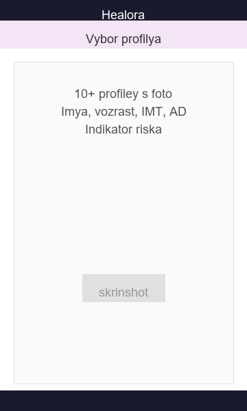 | Выбор профиля |
| 2 | 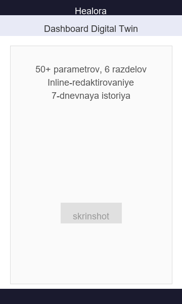 | Дашборд Digital Twin |
| 3 | 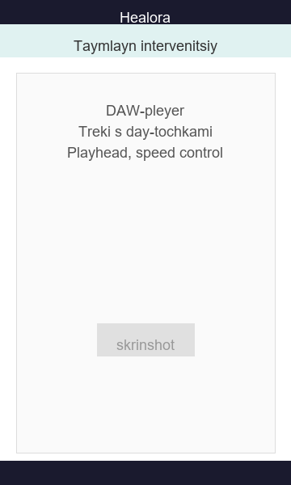 | Таймлайн интервенций |
| 4 | 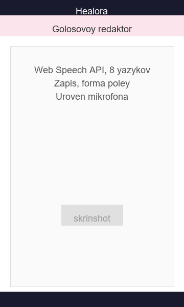 | Голосовой редактор |
| 5 | 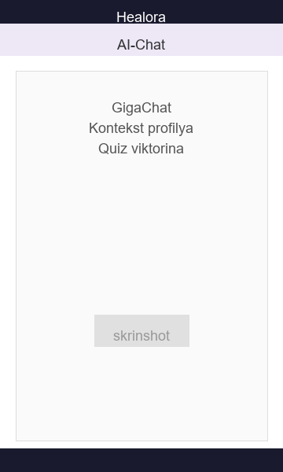 | AI-Чат |
| 6 | 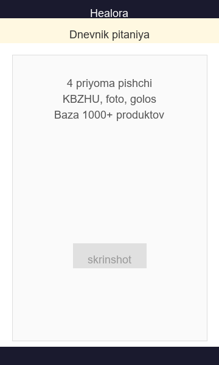 | Дневник питания |
| 7 | 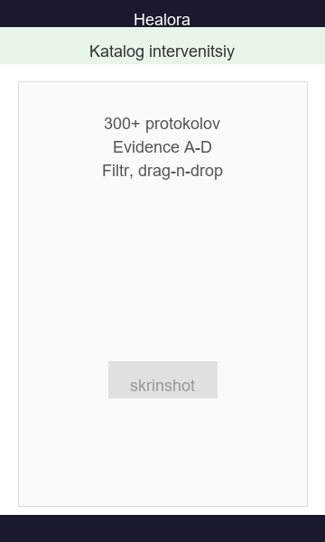 | Каталог интервенций |
| 8 | 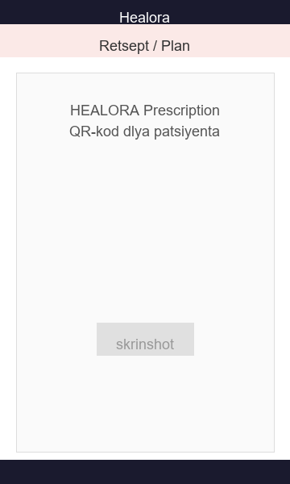 | Рецепт/План |
| 9 | 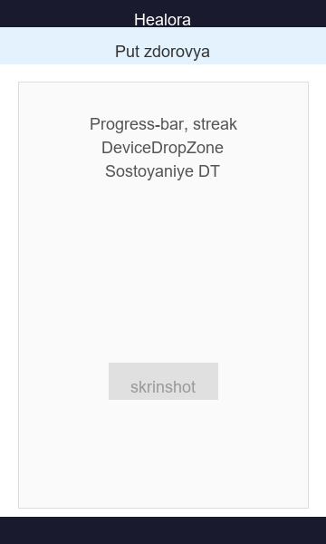 | Путь здоровья |
| 10 | 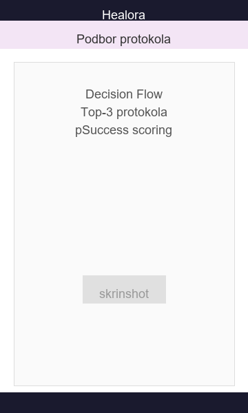 | Подбор протокола |

### 8.5.6. Ссылки на развёрнутый прототип

| Ресурс | URL |
|--------|-----|
| Продуктивная среда | [healora.ru/digital-twin/](https://healora.ru/digital-twin/) |
| Стенд разработки | [dev.healora.ru/digital-twin/](https://dev.healora.ru/digital-twin/) |
| GitHub | [github.com/NutriLabAdm/healora](https://github.com/NutriLabAdm/healora) |
| Презентация | `docs/Healora_v6.pdf` |
